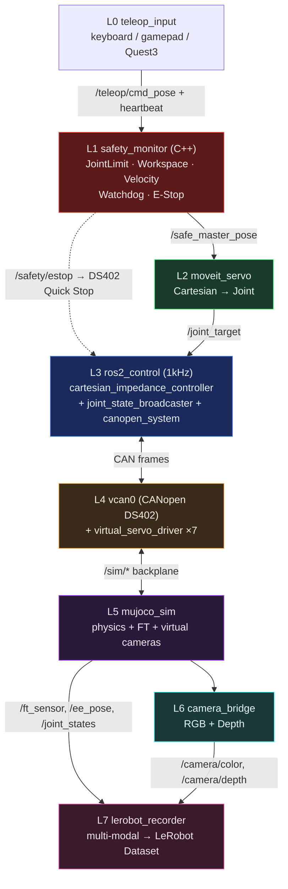
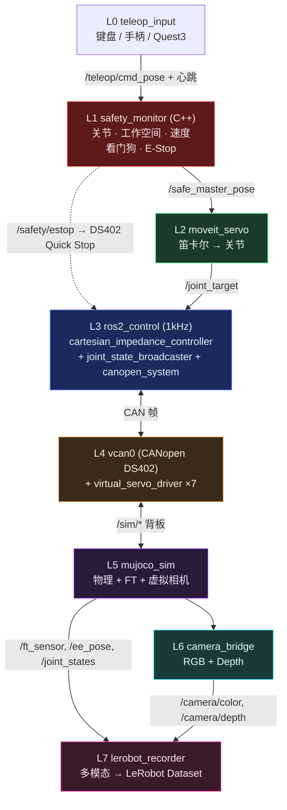

# ros2-arm-teleoperation-suite

[English](#english) | [中文](#中文)

---

<a name="english"></a>
## 🇬🇧 English

### Overview

`ros2-arm-teleoperation-suite` is a full-pipeline ROS 2 (Jazzy) robotic arm teleoperation suite, completely based on software simulation (without physical hardware). The **V2 architecture** is designed as an industrial-grade stack (not a teaching demo), mirroring how real industrial arms are built: a dedicated safety layer, decoupled motion/control layers, a `ros2_control` real-time loop, a CANopen DS402 fieldbus driving a simulated servo drive, vision perception, and multi-modal LeRobot data recording.

> **Architecture spec: [`docs/ARCHITECTURE_V2.md`](docs/ARCHITECTURE_V2.md)** (mermaid diagrams, node/topic graphs, package layout, launch design, M1–M6 milestones). V1 design is archived in [`docs/DESIGN_SPEC.md`](docs/DESIGN_SPEC.md).

### Key Features (V2 · 7 layers)

1. **L0 Teleop Input**: Keyboard / gamepad / Quest 3 → `/teleop/cmd_pose` + heartbeat.
2. **L1 Safety Layer (C++)**: `safety_monitor` with Joint / Workspace / Velocity limit monitors, communication watchdog, and a latching E-Stop wired to DS402 Quick Stop. Outputs `/safe_master_pose` only when all checks pass.
3. **L2 Motion Layer**: MoveIt 2 Servo for Cartesian→joint servoing with singularity / joint-limit avoidance, emitting `/joint_target` (decoupled from control).
4. **L3 Control Layer (`ros2_control`, 1kHz)**: Cartesian impedance controller as a `controller_interface` plugin + `joint_state_broadcaster`, hot-swappable with `joint_trajectory_controller`.
5. **L4 Fieldbus / Drive**: `canopen_system` hardware interface over vcan0 (CANopen DS402 PDO/SDO/NMT/EMCY) → `virtual_servo_driver` simulating DS402 state machine, encoder feedback, and fault states.
6. **L5 Physics Simulation**: `mujoco` v3 (Franka Panda) as a pure physics server + virtual cameras; ground-truth vs. fieldbus-measured state separation.
7. **L6 Perception + L7 Recording**: `camera_bridge` (RGB/Depth) and a multi-modal `lerobot_recorder` (state, ee_pose, ft, gripper, rgb, depth, action, timestamp) → LeRobot dataset for ACT / Diffusion Policy.

### System Architecture (V2)



> Full layered diagrams (node graph, topic graph, launch architecture) are in [`docs/ARCHITECTURE_V2.md`](docs/ARCHITECTURE_V2.md).

### Quick Start

ROS 2 Jazzy should be run with the system Python 3.12 environment (`/usr/bin/python3` + `/opt/ros/jazzy`). Do not run `ros2 launch` from the conda `ros2-teleop` environment; keep conda for LeRobot data processing, training, and notebooks.

```bash
# 1. Source ROS 2
source /opt/ros/jazzy/setup.bash

# 2. Setup virtual CAN interface
bash scripts/setup_vcan.sh

# 3. Install dependencies
bash scripts/install_deps.sh

# 4. Build the workspace
colcon build

# 5. Source workspace environment
source install/setup.bash

# 6. Launch the full system (sim mode, impedance controller)
ros2 launch teleop_bringup full_system.launch.py

# Variants
ros2 launch teleop_bringup m1_control_sim.launch.py                 # M1 smoke: ros2_control + MuJoCo
ros2 launch teleop_bringup full_system.launch.py controller:=forward        # M1/M2 torque path
ros2 launch teleop_bringup full_system.launch.py use_sim:=false can_interface:=can0  # real CAN
ros2 launch teleop_bringup full_system.launch.py record:=true               # enable recorder
```

---

<a name="中文"></a>
## 🇨🇳 中文

### 项目概述

`ros2-arm-teleoperation-suite` 是一套基于 ROS 2 (Jazzy) 的机械臂遥操作全链路系统，无实体硬件、纯软件仿真。**V2 架构**以「工业级机械臂软件栈」为目标重构（而非教学演示）：独立安全层、运动/控制解耦、`ros2_control` 实时主循环、CANopen DS402 现场总线驱动虚拟伺服、视觉感知层、多模态 LeRobot 数据录制。

> **架构规范见 [`docs/ARCHITECTURE_V2.md`](docs/ARCHITECTURE_V2.md)**（Mermaid 架构图、节点图、Topic 图、Package 结构、Launch 架构、M1–M6 里程碑）。V1 设计存档于 [`docs/DESIGN_SPEC.md`](docs/DESIGN_SPEC.md)。

### 核心特性（V2 · 七层）

1. **L0 遥操作输入**：键盘 / 手柄 / Quest3 → `/teleop/cmd_pose` + 心跳。
2. **L1 安全层（C++）**：`safety_monitor` 集成关节/工作空间/速度限位监视器、通信看门狗、可锁存 E-Stop（联动 DS402 Quick Stop）；全部检查通过才输出 `/safe_master_pose`。
3. **L2 运动层**：MoveIt 2 Servo 笛卡尔→关节伺服，自带奇异点/关节限位规避，输出 `/joint_target`（与控制解耦）。
4. **L3 控制层（`ros2_control`，1kHz）**：笛卡尔阻抗控制器作为 `controller_interface` 插件 + `joint_state_broadcaster`，可与 `joint_trajectory_controller` 热切换。
5. **L4 现场总线/驱动**：`canopen_system` 硬件接口经 vcan0（CANopen DS402 PDO/SDO/NMT/EMCY）→ `virtual_servo_driver` 仿真 DS402 状态机、编码器反馈、故障态。
6. **L5 物理仿真**：`mujoco` v3（Franka Panda）作为纯物理服务器 + 虚拟相机；区分仿真真值与总线测得值。
7. **L6 感知 + L7 录制**：`camera_bridge`（RGB/Depth）+ 多模态 `lerobot_recorder`（state / ee_pose / ft / gripper / rgb / depth / action / timestamp）→ LeRobot 数据集，兼容 ACT / Diffusion Policy。

### 系统架构（V2）



> 完整分层图（节点图、Topic 图、Launch 架构）见 [`docs/ARCHITECTURE_V2.md`](docs/ARCHITECTURE_V2.md)。

### 快速开始

ROS 2 Jazzy 主运行环境使用系统 Python 3.12（`/usr/bin/python3` + `/opt/ros/jazzy`）。不要在 conda `ros2-teleop` 环境里运行 `ros2 launch`；conda 仅用于 LeRobot 数据处理、训练和 notebook。

```bash
# 1. Source ROS 2
source /opt/ros/jazzy/setup.bash

# 2. 配置虚拟 CAN 环境
bash scripts/setup_vcan.sh

# 3. 安装依赖
bash scripts/install_deps.sh

# 4. 编译工作空间
colcon build

# 5. Source 工作空间环境
source install/setup.bash

# 6. 一键启动全链路系统（仿真模式 + 阻抗控制器）
ros2 launch teleop_bringup full_system.launch.py

# 常用变体
ros2 launch teleop_bringup m1_control_sim.launch.py                 # M1 验证：ros2_control + MuJoCo
ros2 launch teleop_bringup full_system.launch.py controller:=forward        # M1/M2 力矩直通
ros2 launch teleop_bringup full_system.launch.py use_sim:=false can_interface:=can0  # 实体 CAN
ros2 launch teleop_bringup full_system.launch.py record:=true               # 启用录制
```

### 演示视频

*(演示 GIF 或视频占位 - 待补充至 `media/` 目录)*

### 开发者文档

请参阅 `docs/` 目录获取详细的设计规范与各里程碑技术文档：
- [DESIGN_SPEC.md](docs/DESIGN_SPEC.md): 整体设计规范
- [ROADMAP.md](docs/ROADMAP.md): 开发路线图
- [SPEC_M1_CAN_RS485.md](docs/SPEC_M1_CAN_RS485.md): CAN/RS485 通信层规范
- [SPEC_M2_MUJOCO_BRIDGE.md](docs/SPEC_M2_MUJOCO_BRIDGE.md): MuJoCo 桥接层规范
- [SPEC_M3_IMPEDANCE_CTRL.md](docs/SPEC_M3_IMPEDANCE_CTRL.md): C++ 阻抗控制器规范
- [SPEC_M4_FULL_PIPELINE.md](docs/SPEC_M4_FULL_PIPELINE.md): 全链路集成规范
- [SPEC_M5_LEROBOT_RECORDER.md](docs/SPEC_M5_LEROBOT_RECORDER.md): LeRobot 数据录制层规范
