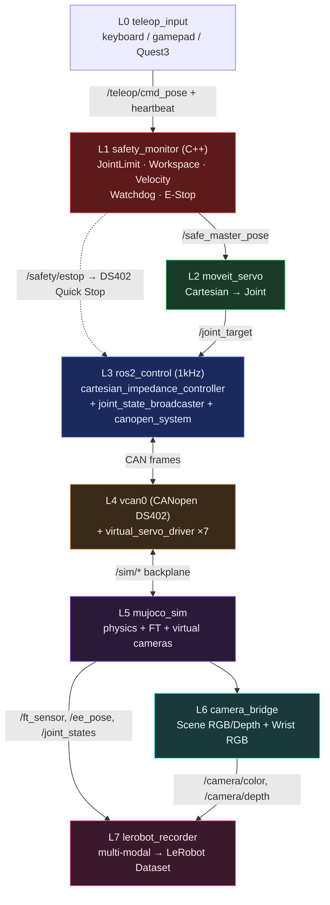
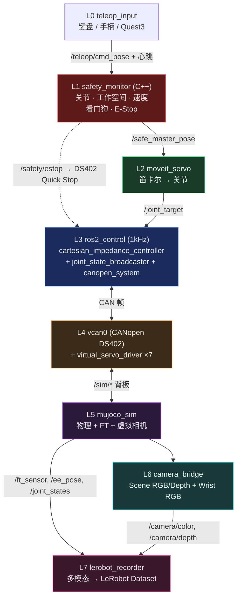
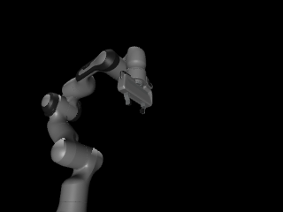
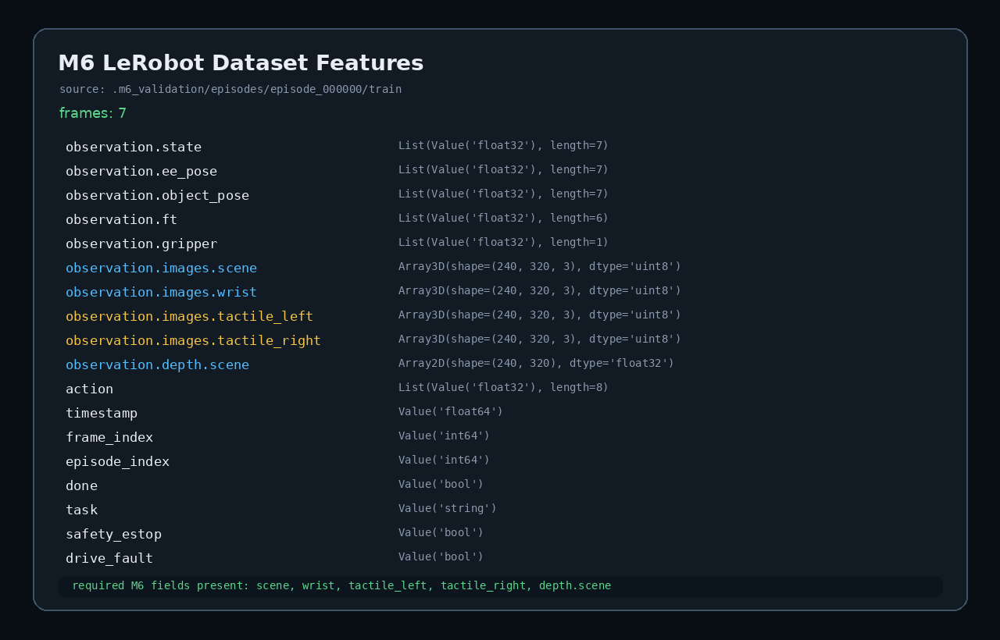

# ros2-arm-teleoperation-suite

[English](#english) | [中文](#中文)

---

<a name="english"></a>
## 🇬🇧 English

### Overview

`ros2-arm-teleoperation-suite` is a full-pipeline ROS 2 (Jazzy) robotic arm teleoperation suite, completely based on software simulation (without physical hardware). The **V2 architecture** is designed as an industrial-grade stack (not a teaching demo), mirroring how real industrial arms are built: a dedicated safety layer, decoupled motion/control layers, a `ros2_control` real-time loop, a CANopen DS402 fieldbus driving a simulated servo drive, vision perception, and multi-modal LeRobot data recording.

> **Architecture spec: [`docs/ARCHITECTURE_V2.md`](docs/ARCHITECTURE_V2.md)** (mermaid diagrams, node/topic graphs, package layout, launch design, M1–M7 milestones). Project scope and acceptance boundaries are summarized in [`docs/PROJECT_SCOPE_AND_ACCEPTANCE.md`](docs/PROJECT_SCOPE_AND_ACCEPTANCE.md). V1 design is archived in [`docs/DESIGN_SPEC.md`](docs/DESIGN_SPEC.md).

### Key Features (V2 · 7 layers)

1. **L0 Teleop Input**: Keyboard / SpaceMouse / gamepad / Quest 3 → `/teleop/cmd_pose` + heartbeat. All devices share a **pluggable `TeleopDriverBase` interface** — swapping input hardware requires zero changes to downstream layers.
2. **L1 Safety Layer (C++)**: `safety_monitor` with Joint / Workspace / Velocity limit monitors, communication watchdog, and a latching E-Stop wired to DS402 Quick Stop. Outputs `/safe_master_pose` only when all checks pass.
3. **L2 Motion Layer**: MoveIt 2 Servo for Cartesian→joint servoing with singularity / joint-limit avoidance, emitting `/joint_target` (decoupled from control).
4. **L3 Control Layer (`ros2_control`, 1kHz)**: Cartesian impedance controller as a `controller_interface` plugin + `joint_state_broadcaster`, hot-swappable with `joint_trajectory_controller`.
5. **L4 Fieldbus / Drive**: `canopen_system` hardware interface over vcan0 (CANopen DS402 PDO/SDO/NMT/EMCY) → `virtual_servo_driver` simulating DS402 state machine, encoder feedback, and fault states.
6. **L5 Physics Simulation**: `mujoco` v3 (Franka Panda) as a pure physics server + virtual cameras; ground-truth vs. fieldbus-measured state separation.
7. **L6 Perception + L7 Recording**: `camera_bridge` (scene RGB/Depth + wrist RGB) and a multi-modal `lerobot_recorder` (state, ee_pose, ft, gripper, scene/wrist images, depth, action, timestamp) → LeRobot dataset for ACT / Diffusion Policy.

### System Architecture (V2)



> Full layered diagrams (node graph, topic graph, launch architecture) are in [`docs/ARCHITECTURE_V2.md`](docs/ARCHITECTURE_V2.md).

### End-to-End Pipeline: Teleoperation → Training → Sim2Sim Deployment

```
[Teleop Device]          [MuJoCo Simulation]
      │                          │
      ▼                          ▼
 /teleop/cmd_pose  →  Safety → Servo → Impedance → CAN → Physics
                                                            │
                                          LeRobot Dataset ←┘
                                                  │
                              ACT / Diffusion Policy Training
                                                  │
                              Policy Inference Node (ROS 2)
                                                  │
                                    MuJoCo Sim2Sim Validation
```

The suite covers the complete loop: **data collection → dataset → policy training → sim deployment**. Domain Randomization (object poses, friction, mass) in MuJoCo ensures dataset diversity for robust policy learning.

### Quick Start

ROS 2 Jazzy should be run with the system Python 3.12 environment (`/usr/bin/python3` + `/opt/ros/jazzy`). Do not run `ros2 launch` from the conda `ros2-teleop` environment; keep conda for LeRobot data processing, training, and notebooks.

```bash
# 1. Source ROS 2
source /opt/ros/jazzy/setup.bash

# 2. Setup virtual CAN interface
bash scripts/setup_vcan.sh

# 3. Install dependencies
bash scripts/install_deps.sh

# 4. Build the workspace
colcon build

# 5. Source workspace environment
source install/setup.bash

# 6. Launch the full system (sim mode, impedance controller)
ros2 launch teleop_bringup full_system.launch.py

# Variants
ros2 launch teleop_bringup m1_control_sim.launch.py                 # M1 smoke: ros2_control + MuJoCo
ros2 launch teleop_bringup full_system.launch.py controller:=forward        # M1/M2 torque path
ros2 launch teleop_bringup full_system.launch.py use_sim:=false can_interface:=vcan0 # CANopen path through virtual DS402 drives
ros2 launch teleop_bringup full_system.launch.py use_sim:=false can_interface:=can0  # future real CAN bring-up
ros2 launch teleop_bringup full_system.launch.py record:=true               # enable recorder
ros2 launch teleop_bringup full_system.launch.py teleop_driver:=gamepad     # Xbox/PS gamepad

# M4/M6 validation / cleanup
bash scripts/validate_m4_motion_layer.sh --launch   # launch stack + run acceptance checks
bash scripts/validate_m5_safety_layer.sh --launch   # M5 safety / E-Stop checks
bash scripts/validate_m6_perception_recorder.sh --launch  # RGB/Depth + LeRobot dataset checks
bash scripts/capture_m7_demo.sh                     # M7 MuJoCo grasp/demo GIF (sim-direct)
bash scripts/stop_stack.sh                          # tear down lingering background nodes
```

---

<a name="中文"></a>
## 🇨🇳 中文

### 项目概述

`ros2-arm-teleoperation-suite` 是一套基于 ROS 2 (Jazzy) 的机械臂遥操作全链路系统，无实体硬件、纯软件仿真。**V2 架构**以「工业级机械臂软件栈」为目标重构（而非教学演示）：独立安全层、运动/控制解耦、`ros2_control` 实时主循环、CANopen DS402 现场总线驱动虚拟伺服、视觉感知层、多模态 LeRobot 数据录制。

> **架构规范见 [`docs/ARCHITECTURE_V2.md`](docs/ARCHITECTURE_V2.md)**（Mermaid 架构图、节点图、Topic 图、Package 结构、Launch 架构、M1–M7 里程碑）。项目边界与验收说明见 [`docs/PROJECT_SCOPE_AND_ACCEPTANCE.md`](docs/PROJECT_SCOPE_AND_ACCEPTANCE.md)。V1 设计存档于 [`docs/DESIGN_SPEC.md`](docs/DESIGN_SPEC.md)。

### 核心特性（V2 · 七层）

1. **L0 遥操作输入**：键盘 / SpaceMouse / 手柄 / Quest3 → `/teleop/cmd_pose` + 心跳。所有设备共享**可插拔 `TeleopDriverBase` 接口**，切换输入设备无需改动下游任何层。
2. **L1 安全层（C++）**：`safety_monitor` 集成关节/工作空间/速度限位监视器、通信看门狗、可锁存 E-Stop（联动 DS402 Quick Stop）；全部检查通过才输出 `/safe_master_pose`。
3. **L2 运动层**：MoveIt 2 Servo 笛卡尔→关节伺服，自带奇异点/关节限位规避，输出 `/joint_target`（与控制解耦）。
4. **L3 控制层（`ros2_control`，1kHz）**：笛卡尔阻抗控制器作为 `controller_interface` 插件 + `joint_state_broadcaster`，可与 `joint_trajectory_controller` 热切换。
5. **L4 现场总线/驱动**：`canopen_system` 硬件接口经 vcan0（CANopen DS402 PDO/SDO/NMT/EMCY）→ `virtual_servo_driver` 仿真 DS402 状态机、编码器反馈、故障态。
6. **L5 物理仿真**：`mujoco` v3（Franka Panda）作为纯物理服务器 + 虚拟相机；区分仿真真值与总线测得值。
7. **L6 感知 + L7 录制**：`camera_bridge`（scene RGB/Depth + wrist RGB）+ 多模态 `lerobot_recorder`（state / ee_pose / ft / gripper / scene/wrist images / depth / action / timestamp）→ LeRobot 数据集，兼容 ACT / Diffusion Policy。

### 系统架构（V2）



> 完整分层图（节点图、Topic 图、Launch 架构）见 [`docs/ARCHITECTURE_V2.md`](docs/ARCHITECTURE_V2.md)。

### 端到端 Pipeline：遥操作 → 训练 → Sim2Sim 部署

```
[遥操作设备]                    [MuJoCo 仿真]
      │                              │
      ▼                              ▼
 /teleop/cmd_pose → 安全层 → Servo → 阻抗控制 → CAN → 物理引擎
                                                        │
                                        LeRobot Dataset ←┘
                                                │
                            ACT / Diffusion Policy 训练
                                                │
                            策略推理节点（ROS 2）
                                                │
                                  MuJoCo Sim2Sim 验证
```

全链路覆盖：**数据采集 → 数据集 → 策略训练 → 仿真部署**。MuJoCo 中的 Domain Randomization（物体位姿、摩擦力、质量）确保数据集多样性，提升策略泛化能力。

### 快速开始

ROS 2 Jazzy 主运行环境使用系统 Python 3.12（`/usr/bin/python3` + `/opt/ros/jazzy`）。不要在 conda `ros2-teleop` 环境里运行 `ros2 launch`；conda 仅用于 LeRobot 数据处理、训练和 notebook。

```bash
# 1. Source ROS 2
source /opt/ros/jazzy/setup.bash

# 2. 配置虚拟 CAN 环境
bash scripts/setup_vcan.sh

# 3. 安装依赖
bash scripts/install_deps.sh

# 4. 编译工作空间
colcon build

# 5. Source 工作空间环境
source install/setup.bash

# 6. 一键启动全链路系统（仿真模式 + 阻抗控制器）
ros2 launch teleop_bringup full_system.launch.py

# 常用变体
ros2 launch teleop_bringup m1_control_sim.launch.py                 # M1 验证：ros2_control + MuJoCo
ros2 launch teleop_bringup full_system.launch.py controller:=forward        # M1/M2 力矩直通
ros2 launch teleop_bringup full_system.launch.py use_sim:=false can_interface:=vcan0 # 经过 vcan0 + 虚拟 DS402 驱动器的 CANopen 路径
ros2 launch teleop_bringup full_system.launch.py use_sim:=false can_interface:=can0  # 后续实体 CAN bring-up
ros2 launch teleop_bringup full_system.launch.py record:=true               # 启用录制
ros2 launch teleop_bringup full_system.launch.py teleop_driver:=gamepad     # XBOX/PS 手柄控制

# 如果想在另一个终端单独运行 teleop_input，先关闭全系统内置 teleop，避免两个 /teleop/cmd_pose 发布者互相覆盖
ros2 launch teleop_bringup full_system.launch.py start_teleop:=false
ros2 run teleop_input teleop_input_node --ros-args -p driver_type:=gamepad

# M4/M6 验收 / 清理
bash scripts/validate_m4_motion_layer.sh --launch   # 自动起栈 + 采集验收指标
bash scripts/validate_m5_safety_layer.sh --launch   # M5 安全层 / E-Stop 验收
bash scripts/open_safety_monitor.sh --launch        # 打开 rqt 安全诊断面板
bash scripts/validate_m6_perception_recorder.sh --launch  # RGB/Depth + LeRobot 数据集验收
bash scripts/capture_m7_demo.sh                     # M7 MuJoCo 抓取/演示 GIF（sim-direct）
bash scripts/stop_stack.sh                          # 开发结束后清理后台节点
```

### 演示

> 采集计划见 [`docs/MEDIA_CAPTURE_PLAN.md`](docs/MEDIA_CAPTURE_PLAN.md)。README 只保留作品集必要证据：主 Demo、M1 控制闭环、M2 CANopen 总线、M6 数据闭环；rqt/plot/robot_monitor 等 GUI 截图作为可选补充，不再阻塞展示。

**M1 ros2_control + MuJoCo 闭环**

<p>
  
  
</p>

<p>
  
</p>

**M2 CANopen DS402 现场总线**

<p>
  
  
</p>

<p>
  
</p>

**M7 主 Demo：MuJoCo 抓取/演示 GIF**

<p>
  
</p>

> M7 GIF 默认使用 `use_sim:=true` sim-direct 路径，证明运动/视觉/录制链路；CANopen 现场总线证据以 M2 `candump`/DS402/EMCY 为准。当前 GIF 可作为作品集主 Demo，但抓取接触稳定性仍是后续调参项。

**M6 视觉 + LeRobot 数据闭环**

<p>
  
  
</p>

| 证据链 | 核心媒体 | 当前状态 |
|---|---|---|
| M1 控制闭环 | `media/m1/panda_gravity_comp.png`, `media/m1/joint_states_hz.png`, `media/m1/rqt_graph_m1.png` | 已用真实 M1 运行证据刷新 |
| M2 CANopen DS402 | `media/m2/candump_pdo.png`, `media/m2/ds402_state_machine.png`, `media/m2/emcy_fault_injection.png` | 已用真实 vcan0 candump / DS402 / EMCY 刷新 |
| M7 主 Demo | `media/m7/grasp_demo.gif` | 已录制，可作为作品集主 Demo；CAN 证据不由此 GIF 声明 |
| M6 数据闭环 | `media/m6/camera_rgb_view.png`, `media/m6/lerobot_dataset_features.png` | 已用真实 recorder dataset 刷新；recorder contract 已包含 wrist RGB |
| M3/M5 深度补充 | M3 曲线、M5 安全诊断 | Optional，不阻塞 README |

收集原始文本证据：

```bash
bash scripts/collect_media_evidence.sh
```


### 开发者文档

请参阅 [`docs/`](docs/) 目录获取详细的设计规范与各里程碑技术文档。完整索引见 [`docs/README.md`](docs/README.md)。

**V2 当前基线：**
- [ARCHITECTURE_V2.md](docs/ARCHITECTURE_V2.md)：V2 工业级七层架构规范
- [PROJECT_SCOPE_AND_ACCEPTANCE.md](docs/PROJECT_SCOPE_AND_ACCEPTANCE.md)：项目边界、非目标、运行模式与验收入口
- [ROADMAP.md](docs/ROADMAP.md)：开发路线图（M1–M7）

**V2 里程碑 SPEC：**
- [SPEC_V2_M1_CONTROL_SKELETON.md](docs/SPEC_V2_M1_CONTROL_SKELETON.md)：✅ ros2_control 骨架 + MuJoCo
- [SPEC_V2_M2_CANOPEN_FIELDBUS.md](docs/SPEC_V2_M2_CANOPEN_FIELDBUS.md)：✅ CANopen DS402 总线
- [SPEC_V2_M3_IMPEDANCE_CTRL.md](docs/SPEC_V2_M3_IMPEDANCE_CTRL.md)：🔧 笛卡尔阻抗控制器
- [SPEC_V2_M4_MOTION_LAYER.md](docs/SPEC_V2_M4_MOTION_LAYER.md)：🔧 MoveIt Servo 运动层
- [SPEC_V2_M5_SAFETY_LAYER.md](docs/SPEC_V2_M5_SAFETY_LAYER.md)：🔲 安全层 + E-Stop
- [SPEC_V2_M6_PERCEPTION_RECORDER.md](docs/SPEC_V2_M6_PERCEPTION_RECORDER.md)：✅ 视觉 + LeRobot Recorder
- [SPEC_V2_M7_TELEOP_SYNTH.md](docs/SPEC_V2_M7_TELEOP_SYNTH.md)：✅ 遥操作抽象 + 合成数据 / Domain Randomization

**V1 存档（参照用）：** [DESIGN_SPEC.md](docs/DESIGN_SPEC.md) 及各 `SPEC_M*.md`
