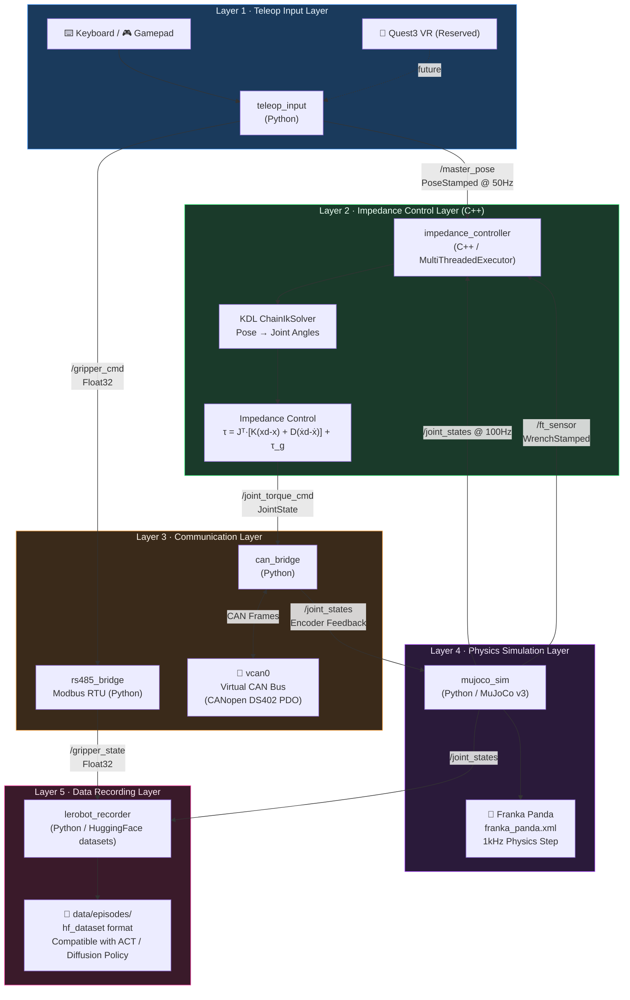
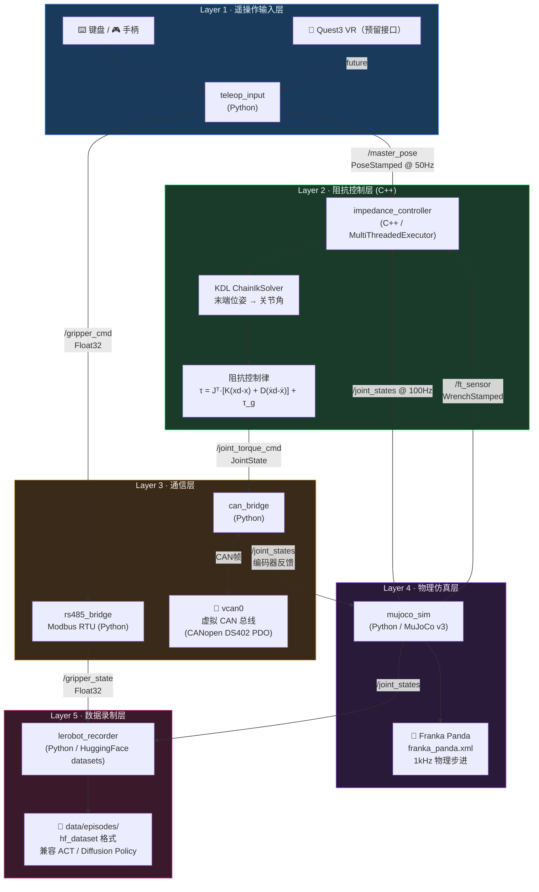

# ros2-arm-teleoperation-suite

[English](#english) | [中文](#中文)

---

<a name="english"></a>
## 🇬🇧 English

### Overview

`ros2-arm-teleoperation-suite` is a full-pipeline ROS 2 (Jazzy) robotic arm teleoperation suite, completely based on software simulation (without physical hardware). It is designed to demonstrate the complete 5-layer architecture of an embodied AI teleoperation system.

### Key Features

1. **Teleop Input Layer**: Converts keyboard/gamepad inputs to target pose commands (with pre-reserved interfaces for Quest 3 VR).
2. **Control Layer (C++)**: 6-DOF Cartesian impedance controller with KDL-based Inverse Kinematics and adaptive stiffness for contact compliance.
3. **CAN / RS485 Bridge Layer**: Virtual CAN bus (vcan0) with CANopen DS402 PDO frame encoding/decoding, and pymodbus-based Modbus RTU simulation for the gripper.
4. **Physics Simulation Layer**: 1kHz physics simulation using `mujoco` v3 and the Franka Panda model.
5. **Data Recording Layer**: Records teleoperation episodes in the standard LeRobot (HuggingFace `datasets`) format, ready to be consumed by ACT / Diffusion Policy training pipelines.

### System Architecture



### Quick Start

```bash
# 1. Setup virtual CAN interface
bash scripts/setup_vcan.sh

# 2. Install dependencies
bash scripts/install_deps.sh

# 3. Build the workspace
colcon build

# 4. Source environment
source install/setup.bash

# 5. Launch the full system
ros2 launch launch/full_system.launch.py
```

---

<a name="中文"></a>
## 🇨🇳 中文

### 项目概述

`ros2-arm-teleoperation-suite` 是一套基于 ROS 2 (Jazzy) 的机械臂遥操作全链路系统。在无实体硬件的条件下，纯基于软件仿真完整体现具身智能遥操作系统的五层核心架构。

### 核心特性

1. **遥操作输入层**：支持键盘/手柄输入，转换为末端位姿指令（预留 Quest 3 接口）。
2. **阻抗控制层（C++）**：基于 KDL 实现六维笛卡尔阻抗控制器，支持接触力自适应刚度调节（柔顺控制）。
3. **总线通信层**：基于 `vcan0` 虚拟 CAN 总线实现 CANopen DS402 PDO 帧编解码；基于 `pymodbus` 仿真 RS485 Modbus RTU 夹爪控制。
4. **物理仿真层**：基于 `mujoco` v3 引擎运行 Franka Panda 机械臂，1kHz 高频物理步进。
5. **数据录制层**：支持将遥操作记录为 HuggingFace `datasets` 格式（LeRobot 兼容），无缝接入具身智能模型（ACT / Diffusion Policy）训练管线。

### 系统架构



### 快速开始

```bash
# 1. 配置虚拟 CAN 环境
bash scripts/setup_vcan.sh

# 2. 安装依赖
bash scripts/install_deps.sh

# 3. 编译工作空间
colcon build

# 4. Source 环境
source install/setup.bash

# 5. 一键启动全链路系统
ros2 launch launch/full_system.launch.py
```

### 演示视频

*(演示 GIF 或视频占位 - 待补充至 `media/` 目录)*

### 开发者文档

请参阅 `docs/` 目录获取详细的设计规范与各里程碑技术文档：
- [DESIGN_SPEC.md](docs/DESIGN_SPEC.md): 整体设计规范
- [ROADMAP.md](docs/ROADMAP.md): 开发路线图
- [SPEC_M1_CAN_RS485.md](docs/SPEC_M1_CAN_RS485.md): CAN/RS485 通信层规范
- [SPEC_M2_MUJOCO_BRIDGE.md](docs/SPEC_M2_MUJOCO_BRIDGE.md): MuJoCo 桥接层规范
- [SPEC_M3_IMPEDANCE_CTRL.md](docs/SPEC_M3_IMPEDANCE_CTRL.md): C++ 阻抗控制器规范
- [SPEC_M4_FULL_PIPELINE.md](docs/SPEC_M4_FULL_PIPELINE.md): 全链路集成规范
- [SPEC_M5_LEROBOT_RECORDER.md](docs/SPEC_M5_LEROBOT_RECORDER.md): LeRobot 数据录制层规范
