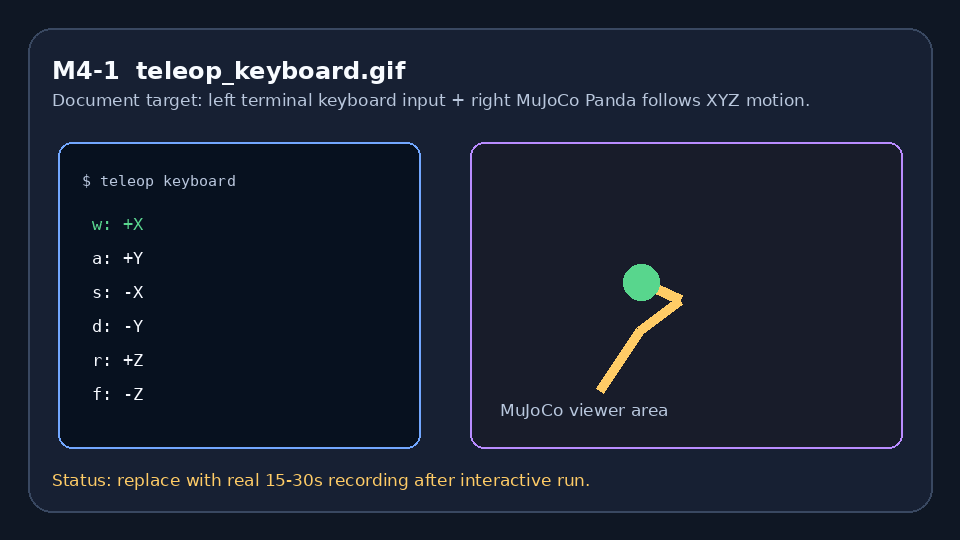

# ros2-arm-teleoperation-suite

**Franka Panda 遥操作、实时控制与仿真采集**

> **Current as of 2026-08-21.** This is the Execution / Acquisition / Task-GT
> repository of one **Panda Manipulation Runtime, Data & Validation System**.
> Route A's current learned-policy result is Reach `1/4`, Grasp `0/4`, Lift
> `0/4`; Route B is an Isaac–ROS observation/control-state precondition block,
> not a policy task result. The node default remains `legacy`; remote async and
> authoritative experiment paths exist but are not an accepted Isaac online loop.
> Current cross-repo facts live in the midstream canonical document.

键盘或手柄给出末端目标 → 安全层拦截危险指令 → MoveIt Servo 生成关节轨迹 → 笛卡尔阻抗控制器出力矩 → MuJoCo 里的 Panda 动起来，并把关节、相机、力觉写成 LeRobot episode。

这是三仓机械臂项目的**上游**：负责让手臂在仿真里可控地运动，并产出带物理判定的示教数据。不训练模型，也不做策略回放。


<p align="center"><sub>MuJoCo 仿真抓取演示。当前是软件仿真栈，没有真实 Franka 实机。</sub></p>



<p align="center"><sub>键盘遥操作：人给出笛卡尔增量，后面整条控制链跟着动。</sub></p>

| ROS 2 Jazzy | C++ / Python | MoveIt 2 Servo | ros2_control | MuJoCo v3 | CANopen DS402 |
| :---: | :---: | :---: | :---: | :---: | :---: |

---

## 整个项目做了什么

一套 **Franka Panda 从示教到评测的软件闭环**，拆成三个仓库，避免 ROS 实时栈、PyTorch 训练、PyBullet 回放挤在同一个环境里：

| 仓库 | 一句话 | 主要技术 |
| --- | --- | --- |
| **本仓 · 上游** | 让手臂动，录示教 | ROS 2、MoveIt Servo、阻抗控制、MuJoCo、LeRobot 录制 |
| [中游 data lab](https://github.com/inayina/robot-arm-episode-data-lab) | 把示教变成可训练、可评测的数据与模型 | PyTorch、LeRobot、ACT、SmolVLA、SHA 锁定 release |
| [下游 bridge](https://github.com/inayina/ros2-moveit-pybullet-bridge) | 把导出动作在 PyBullet 里回放并监控风险 | PyBullet、PolicyRunner、分布监控、HOC 控制台 |

本仓读完，应能回答：**机械臂是怎么控的、数据是怎么采的、用了哪些 ROS 2 组件。** 训练数字和回放监控请看另外两个仓。

---

## 本仓解决什么问题

工业机械臂软件通常不是「一个 Python 脚本直接写力矩」。真实系统会把**人机输入、安全、运动生成、力矩控制、总线、物理、感知、录制**拆开。本仓按这个分层，在仿真里把链路搭起来：

```text
L0  teleop_input          键盘 / 手柄 → 末端位姿 + 心跳
L1  safety_monitor  C++   限位 · 速度 · watchdog · E-Stop
L2  MoveIt Servo          笛卡尔 → 关节目标（约 125 Hz，无 RRT）
L3  ros2_control          笛卡尔阻抗控制器（仿真 500 Hz）
L4  CANopen / DS402       虚拟伺服驱动（vcan0；真机路径预留 1 kHz）
L5  mujoco_sim            Panda 物理 1 kHz；编码器 500 Hz
L6  camera_bridge         场景 / 腕部 RGBD + 指尖视触觉
L7  lerobot_recorder      多模态对齐 → episode_*/train/ + meta.json
```

设计原则：MuJoCo 给**仿真真值**；控制栈默认只信编码器测得状态。这是真机「真值 vs 测量值」的软件预演，不是已经上了真机。

---

## 我在本仓具体做了什么

**实时控制链。** C++ `safety_monitor` 独立看心跳和限位；MoveIt Servo 做笛卡尔伺服；`cartesian_impedance_controller` 作为 `ros2_control` 插件出力矩。仿真控制环 **500 Hz**（`control_rate_sim.yaml`），与 Servo 125 Hz、编码器 500 Hz 成整数倍，减少拍频。

**安全闭环。** 心跳超时或限位触发后 Hold（发零速度）或锁存 E-Stop；仿真侧力矩置零。CAN 路径可走 DS402 Quick Stop。这是软件安全路径，不是认证的功能安全或硬件急停。

**设备接口预演。** `canopen_hw_interface` + `virtual_servo_driver` 在 `vcan0` 上跑 DS402 状态机、PDO/SDO/EMCY。夹爪是 **MockModbusClient**（内存寄存器），不是真实 Modbus TCP/RTU。

**多模态采集。** 场景相机、腕部相机、左右指尖 GelSight-like 触觉图，与关节、末端位姿、力/力矩、物体位姿时间对齐后写入 HuggingFace Dataset 目录。

**任务门禁。** 批采 FSM：Hover → Descend → Close → Lift → Transport → Place → Release。主轨 `_validate_episode` 决定这条 episode 是留下还是丢掉；辅轨 `grasp_monitor` 只做实时监督。训练数据强制关闭模拟吸附（`grasp_assist_enabled:=false`）。

| 模块 | 路径 | 技术 |
| --- | --- | --- |
| 一键编排 | `src/teleop_bringup/` | ROS 2 launch：描述、仿真、安全、Servo、ros2_control、可选录制 |
| 遥操作 | `src/teleop_input/` | 键盘 / 手柄 → `/teleop/cmd_pose` |
| 运动层 | `src/teleop_moveit_config/` | MoveIt 2 Servo，笛卡尔跟踪 |
| 阻抗控制 | `src/teleop_controllers/` | C++ `controller_interface` 插件 |
| 安全 | `src/safety_monitor/` | C++ watchdog / 限位 / E-Stop |
| 仿真 | `src/mujoco_sim/` | MuJoCo v3 + mujoco_menagerie Panda |
| 感知 | `src/camera_bridge/` | RGBD + 视触觉渲染 |
| 录制 | `src/lerobot_recorder/` | ApproximateTimeSynchronizer → LeRobot 字段 |
| 批采 / Gate | `src/synth_data_gen/` | 任务 FSM + 物理判定写入 `meta.json` |
| 总线 | `src/canopen_hw_interface/`、`virtual_servo_driver/` | CANopen DS402 虚拟驱动 |
| Isaac 适配 | `src/isaac_sim_adapter/` | 外部 Isaac 进程；有界策略运行，不是默认批采栈 |

<p align="center">
  
  
  
</p>
<p align="center"><sub>场景 RGB、腕部 RGB、指尖视触觉。图片来自 MuJoCo / EGL 渲染，不是示意图。</sub></p>

---

## 当前状态

**已经能跑、有代码和测试的：**

- ROS 2 Jazzy + MuJoCo 的 Panda 遥操作、阻抗控制、安全监视、多模态录制
- 批采物理门禁（`meta.json` 里的 `upstream_gate` / `success`）
- 虚拟 CANopen / DS402 路径；Isaac 以 adapter + 外部进程方式有界接入

**不能从本仓得出的结论：**

- 没有真实 Panda，没有完成 Sim2Real
- 学到的策略会不会抓起来，不由本仓判定（中游离线 Pass ≠ 抓取成功；有界 Isaac 仍为 Hold）
- Mock 夹爪和虚拟 CAN 不是现场总线验收

脚本化 oracle 在修过的物理链上可以 lift 5/5，只说明**仿真执行环境能完成任务**，不能替代学习策略。

---

## 快速开始

需要 ROS 2 Jazzy、系统 Python 3.12。不要用 conda Python 跑 `ros2 launch`。

```bash
colcon build --symlink-install \
  --packages-select lerobot_recorder teleop_bringup mujoco_sim

source /opt/ros/jazzy/setup.bash
source install/setup.bash

ros2 launch teleop_bringup full_system.launch.py \
  record:=true \
  capture_mode:=portfolio \
  camera_rate:=10.0 \
  camera_width:=320 \
  camera_height:=240 \
  auto_record_seconds:=15.0 \
  auto_record_delay_s:=22.0
```

这条命令会自动停录，不要当成长驻服务。环境与验收范围见 [PROJECT_SCOPE_AND_ACCEPTANCE.md](docs/PROJECT_SCOPE_AND_ACCEPTANCE.md)。

---

## 交给下一仓的是什么

输出：`episode_*/train/` + `meta.json`（含 `upstream_gate`、`success`、安全标志）。  
字段包括关节 `state[7]`、夹爪、`ee_pose[7]`、`object_pose[7]`、RGB/触觉图、`action[8]`。  
中游会把 `state[7]+gripper` 适配成训练用 `state[8]`，并把动作派生为 `ee_delta_gripper[7]` —— **适配不在本仓做**。

接口说明：[INTER_REPO_CONTRACTS.md](docs/INTER_REPO_CONTRACTS.md) · 七层架构：[ARCHITECTURE_V2.md](docs/ARCHITECTURE_V2.md)

---

## English Brief

Upstream **ROS 2 teleoperation, motion control, and episode recording** for a simulated Franka Panda. Keyboard/gamepad commands go through a C++ safety monitor, MoveIt Servo, and a 500 Hz Cartesian impedance controller into MuJoCo; cameras and GelSight-like tactile images are synced into LeRobot-style episodes.

This repo does not train policies or replay them. No real Panda and no completed Sim2Real. Sister repos: [data/eval lab](https://github.com/inayina/robot-arm-episode-data-lab), [PyBullet replay/risk](https://github.com/inayina/ros2-moveit-pybullet-bridge).
