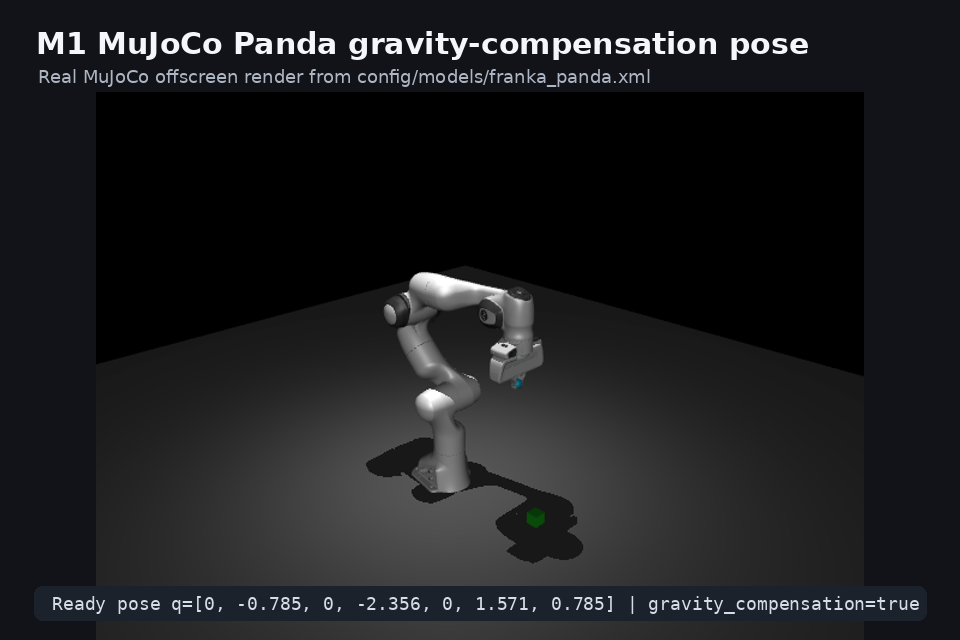
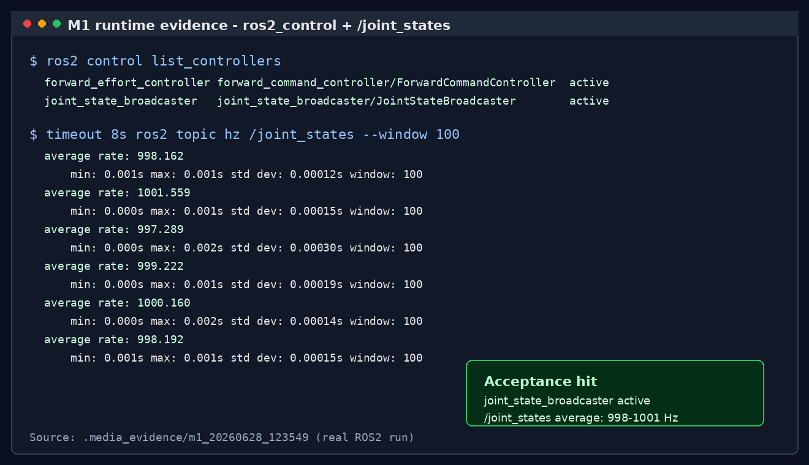
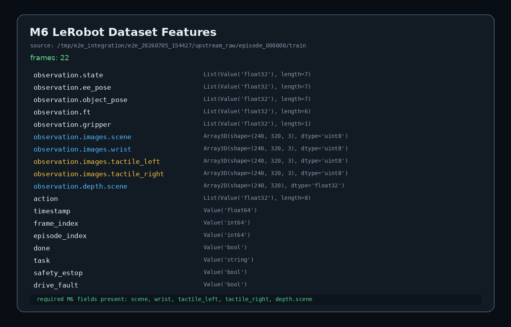
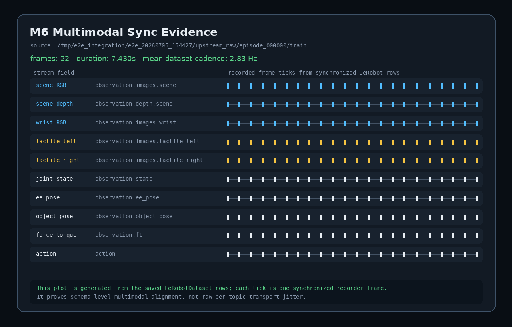
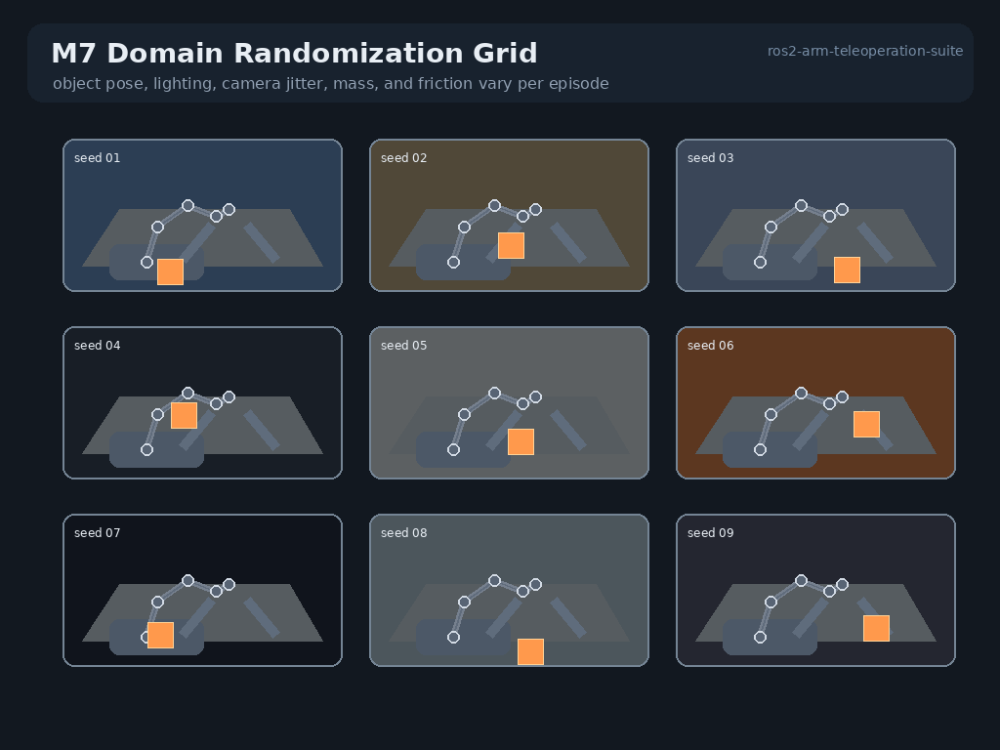
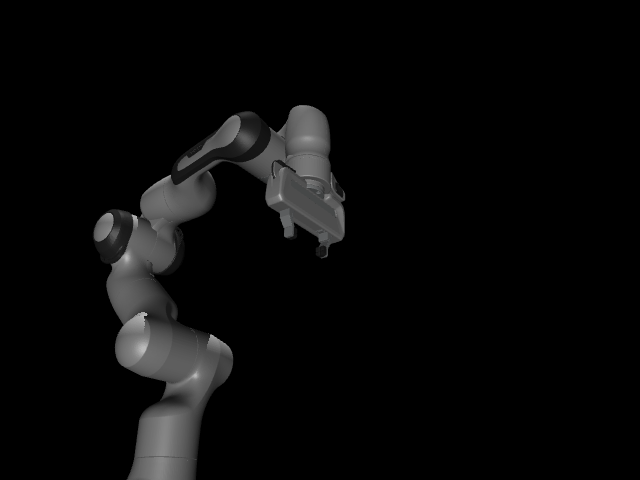
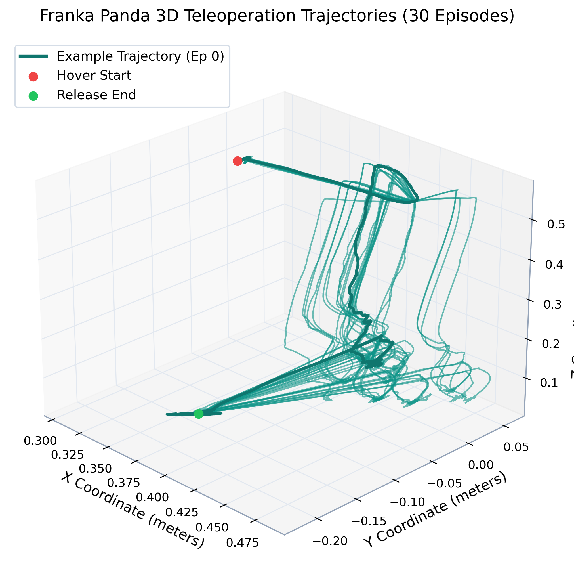

# ros2-arm-teleoperation-suite

`ros2-arm-teleoperation-suite` 是三仓 Panda 闭环的**上游（小脑）**：基于 ROS 2 Jazzy 与
MuJoCo，负责实时控制与采集——遥操作/批采、安全层、MoveIt Servo、阻抗控制、episode 录制、
上游物理门禁；并提供 Isaac 执行面与 continuous task GT。

本仓输入是任务目标、遥操作输入或 batch generation 配置；输出是 raw episode 与 `meta.json`。
不负责中游 schema/release/training，不负责下游 PyBullet replay / risk readiness，也不声称真机部署。

> **在系统中的位置**：策略「大脑」之下的**控制与感知执行面**——没有本仓，中游数据和下游验证无处落地。

## Position In The Three-Repo Loop


| 仓库 | 职责 |
| --- | --- |
| 上游：本仓 | ROS 2 控制栈、MuJoCo/Isaac 交互、teleop/batch、recorder、physical gate、task GT |
| 中游：`robot-arm-episode-data-lab` | adapter、schema、immutable release、训练交付、门禁、handoff |
| 下游：`ros2-moveit-pybullet-bridge` | handoff 重放、dist_monitor、offline risk readiness（不作任务 go/no-go） |

统一事实源见中游 `docs/portfolio/THREE_REPO_CANONICAL_FACTS.md`。
本仓证据索引见 [docs/portfolio/EVIDENCE_INDEX.md](docs/portfolio/EVIDENCE_INDEX.md)。

## Verified Capabilities

| 能力 | 当前状态 | 证据 |
| --- | --- | --- |
| ROS 2 layered teleop/simulation stack | `implemented_and_verified` | `docs/AGENTS.md`, `docs/ARCHITECTURE_V2.md` |
| Task / Motion / Evaluation agent mapping | `implemented_and_verified` | `docs/AGENTS.md` |
| `batch_generator` physical gate | `implemented_and_verified` | `src/synth_data_gen/synth_data_gen/batch_generator.py` |
| LeRobot-style episode recording | `implemented_and_verified` | `docs/INTER_REPO_CONTRACTS.md`, recorder docs |
| Upstream Media V2-M6/V2-M7 multimodal MuJoCo assets | `implemented_not_fully_verified` for full 30 Hz acceptance unless validation logs are attached | `docs/MEDIA_CAPTURE_PLAN.md`, `media/m6/`, `media/m7/` |
| Real Panda hardware deployment | `not_supported` | Project scope excludes this as a current claim |

这里的 **Upstream Media V2-M6/V2-M7** 是本仓早期媒体采集阶段名；跨仓运行时里程碑始终写作
**Policy Runtime M6**，两者不是同一 Gate，也不能互相充当验收证据。

## Canonical Experiment Contribution

The current shared Panda experiment is `panda_30_mlp_20260711`.

| Fact | Value |
| --- | --- |
| Upstream source | `data/episodes_mlp` |
| Dataset size | 30 Panda simulation episodes, 71,737 frames |
| Gate | `upstream_gate=batch_generator` |
| Training constraint | `grasp_assist_enabled:=false` for training data |
| Output handed to midstream | raw episodes with train data and `meta.json` |

The 30/30 valid result is upstream evidence. It should not be described as real-robot success or downstream physical grasp validation.

## Core Evidence

### 实验证据图解读

下表说明本仓在三仓证据中的上游贡献。30-episode 训练/handoff run 与最新
1-episode 下游 smoke 是两个独立 run，当前证据不足以确认后者消费了前者的 handoff。

| 图中区域 | 与本仓关系 | 原始来源 | 边界 |
| --- | --- | --- | --- |
| G0 Upstream Dataset | 本仓通过 `batch_generator` 生成 30 个 Panda 仿真 episode，并写入 `upstream_gate=batch_generator` | 中游归档的 `evidence/upstream/validate_dataset.json`，上游 `data/episodes_mlp` | 证明 MuJoCo/Panda 仿真采集和上游 gate，不证明 real-robot deployment |
| G1 Midstream Release | 30-episode run 形成 release、MLP metrics 和 handoff | 中游 `manifest.json`, `mlp_metrics.json`, `handoff_manifest.json` | 不是本仓训练能力；README 不应把 MLP/ACT 训练归到上游 |
| Independent downstream smoke | 独立的 1-episode PyBullet replay smoke | 中游归档的 `evidence/downstream/benchmark_summary.json` | 未证明与上述 30-episode handoff 属于同一 run；不证明真实 Sim2Real |

30 episodes / 71,737 frames 是上游输出规模；`9.79 / 34.218 ms` 是独立下游 smoke 的延迟数字，属于下游运行结果，不是上游控制层延迟指标。

| Evidence | What it shows | What it does not show |
| --- | --- | --- |
| `media/m1/panda_gravity_comp.png`, `media/m1/joint_states_hz.png` | ROS/MuJoCo control-loop evidence | certified or real hardware control |
| `media/m6/lerobot_dataset_features.png`, `media/m6/multimodal_sync.png` | upstream Media V2-M6 recorder and multimodal synchronization evidence | canonical MLP uses image/tactile features |
| `media/m7/grasp_demo.gif` | MuJoCo grasp-motion demo | real grasp success |
| `media/panda_teleop_trajectories_3d.png` | trajectory distribution visualization | task success rate or Sim2Real generalization |

### 可用实验图片

这些历史实验图可以继续使用，但它们是上游软件仿真、录制和可视化证据，不应被描述成中游训练或下游 replay 的实现证明。

| 图片 | 解释 | 边界 |
| --- | --- | --- |
|  | MuJoCo/Panda gravity compensation 姿态证据 | 不证明 certified hardware control |
|  | `/joint_states` 频率/控制闭环观测 | 不等于下游 benchmark latency |
|  | recorder 输出字段和多模态数据结构 | 不代表 canonical MLP 使用图像/触觉特征 |
|  | 多模态行级同步可视化 | 不证明完整 30 Hz acceptance，除非附验证日志 |
|  | object pose、lighting、camera jitter、mass/friction 的 per-episode 随机化示意 | 只能证明仿真扰动配置可视化，不证明泛化或 Sim2Real |
|  | MuJoCo 抓取动作演示 | 不证明 real-grasp success 或泛化 |
|  | 30-episode 轨迹分布可视化 | 不证明任务成功率或 Sim2Real |

## Quick Verification

```bash
# Software simulation path; requires the ROS 2/MuJoCo environment documented in this repo.
ros2 launch ros2_arm_teleop full_system.launch.py use_sim:=true

# Batch generation path; see docs for exact parameters and environment setup.
ros2 run synth_data_gen batch_generator
```

For reproducible cross-repo validation, use the midstream runbook rather than treating this README as the source of experiment numbers.

Project evidence query and upstream change impact are available from this checkout:

```bash
bin/ask-project "上游当前负责什么？"
bin/project-evidence impact --base HEAD~1 --head HEAD
```

The registry and retrieval implementation remain owned by the midstream repository. Set
`EPISODE_DATA_LAB_ROOT` when that checkout is not in a configured fallback location.

## Code Map

| Path | Purpose |
| --- | --- |
| `src/synth_data_gen/` | batch generation and upstream episode gate |
| `src/lerobot_recorder/` | episode recording |
| `docs/AGENTS.md` | upstream agent mapping |
| `docs/INTER_REPO_CONTRACTS.md` | raw episode contract with midstream |
| `docs/MEDIA_CAPTURE_PLAN.md` | media capture and evidence plan |
| `media/` | captured evidence assets |

## Boundaries

Do not claim from this repo alone:

- formal production safety certification;
- completed real-machine deployment;
- completed Sim2Real;
- midstream MLP/ACT training ownership;
- downstream PyBullet benchmark ownership;
- autonomous online policy rollout.

## Legacy And Extended Material

Older architecture notes, CANopen/vcan0 support material, and broad learning notes are useful background, but README claims should stay tied to current ROS 2/MuJoCo Panda upstream responsibilities.

## Key Documents

- [docs/AGENTS.md](docs/AGENTS.md)
- [docs/PROJECT_SCOPE_AND_ACCEPTANCE.md](docs/PROJECT_SCOPE_AND_ACCEPTANCE.md)
- [docs/INTER_REPO_CONTRACTS.md](docs/INTER_REPO_CONTRACTS.md)
- [docs/MEDIA_CAPTURE_PLAN.md](docs/MEDIA_CAPTURE_PLAN.md)
- [docs/portfolio/EVIDENCE_INDEX.md](docs/portfolio/EVIDENCE_INDEX.md)
- [docs/AGENTS.md#7-project-evidence-agent-集成](docs/AGENTS.md#7-project-evidence-agent-集成)

## English Brief

Upstream (“cerebellum”) of the three-repo Panda loop: ROS 2 Jazzy real-time control,
MuJoCo/Isaac execution, teleop/batch collection, and physical gating. It produces raw
episodes for the midstream data spine and does not own training, downstream replay/risk
readiness, real-robot deployment, or completed Sim2Real.
