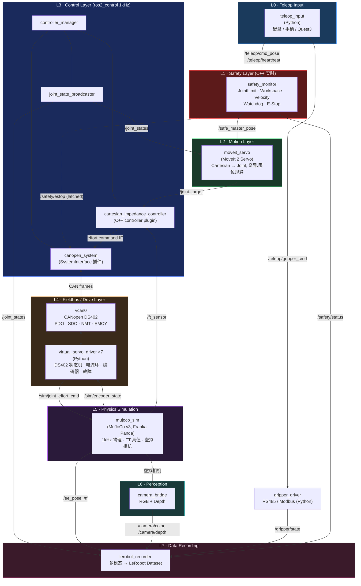
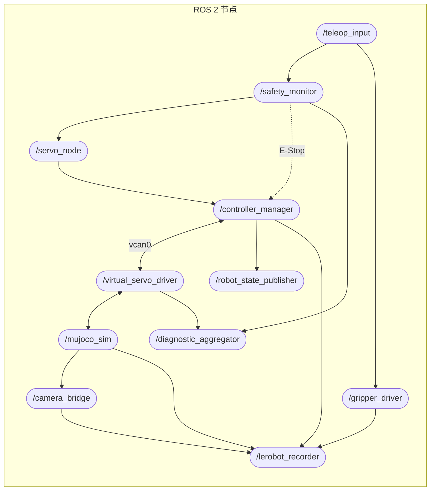
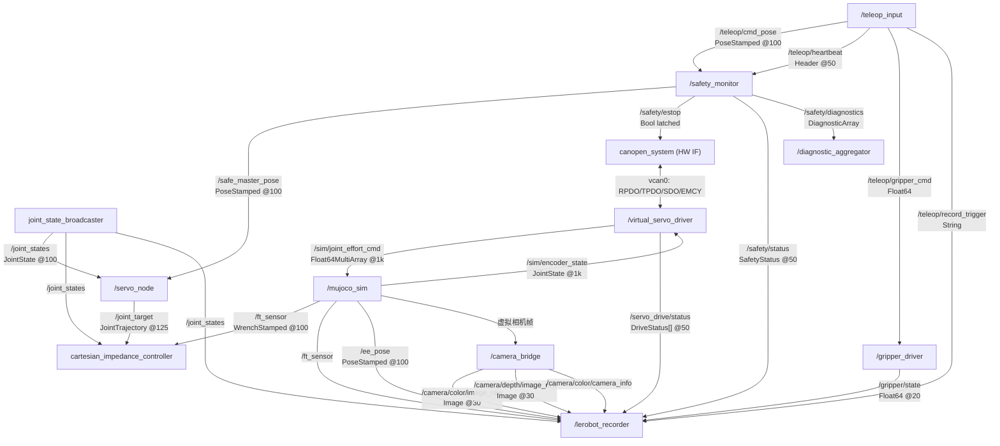
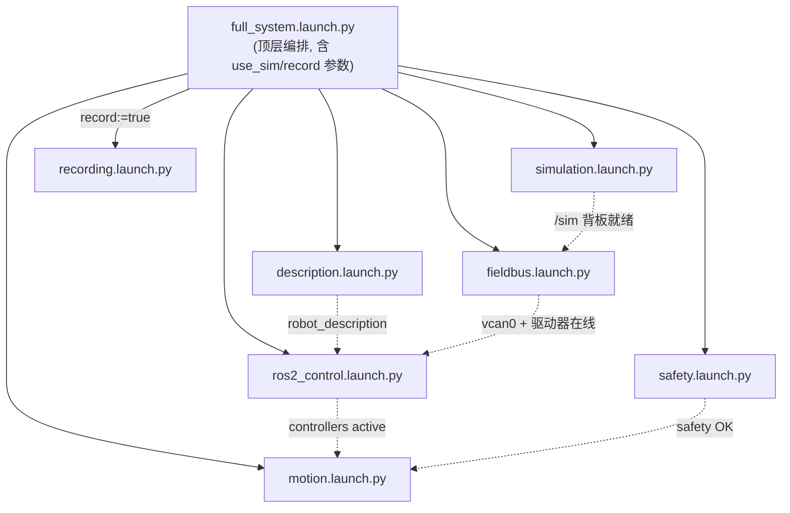
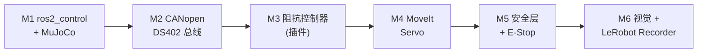

# Architecture V2: `ros2-arm-teleoperation-suite`

**版本**：v2.0-draft  
**创建日期**：2026-06-24  
**目标定位**：从「教学演示」升级为「工业级机械臂遥操作平台」  
**面向岗位**：机器人软件工程师 / 系统集成工程师 / 测试工程师作品集

**技术栈**：ROS 2 Jazzy · MuJoCo v3 · MoveIt 2 Servo · ros2_control · CANopen DS402 · LeRobot

---

## 0. V1 → V2 重构动机

V1 是一条「能跑通」的线性链路，但有几个不符合工业实践的地方：

| V1 问题 | 工业现实 | V2 解决方案 |
|---|---|---|
| Teleop 指令直达控制器，无安全闸 | 任何主端指令都要先过安全监督 | 引入独立 `safety_monitor` 安全层 |
| 控制器内部硬编码 IK，运动与控制耦合 | 运动生成与伺服控制是两层 | 拆出 Motion Layer（MoveIt Servo） |
| CAN 只是「为展示而展示」的旁路 | CAN 是控制器与驱动器之间的真实链路 | CAN 成为 `ros2_control` 硬件接口的下行总线 |
| 控制器自己造 ROS 节点 | 工业臂用 `ros2_control` 实时框架 | 阻抗控制器改为 `ros2_control` 控制器插件 |
| 无视觉，数据只有 joint_state | 具身智能需要多模态观测 | 新增 `camera_bridge` + 多模态 Recorder |
| MuJoCo 直接当「驱动器」 | 驱动器是独立单元，sim 只负责物理 | 拆出 `virtual_servo_driver`（DS402 伺服仿真） |

**V2 核心思想：把「仿真真值」与「经总线测得值」分离。**
MuJoCo 提供物理真值（ground truth）；机器人软件栈只能通过 CANopen 编码器反馈「感知」到状态。
这正是真实机器人「sim-truth vs. measured-state」的工程差异，也是测试工程师最关心的可观测性边界。

---

## 1. 总体架构图（Mermaid）



**关键改动一览**：
- L1 安全层是数据流上的**强制串联节点**（不是旁路）：Teleop 指令只有经过它才能变成 `/safe_master_pose`。
- L3 把阻抗控制器变成 `ros2_control` 的**控制器插件**（与真实 Franka `cartesian_impedance_example_controller` 同构）。
- L4 CAN 成为控制器 ↔ 驱动器的**真实下行链路**；`virtual_servo_driver` 才是把力矩施加到物理引擎的「执行单元」。
- L5 MuJoCo 退化为**纯物理服务器** + 虚拟相机源，通过 `/sim/*` 内部背板与驱动器交互。

---

## 2. ROS2 节点图



**节点 / 语言 / 实时性矩阵**：

| 节点 | 包 | 语言 | 角色 | 频率 | Executor |
|---|---|---|---|---|---|
| `/teleop_input` | `teleop_input` | Python | 主端输入 + 心跳 | 100 Hz | SingleThreaded |
| `/safety_monitor` | `safety_monitor` | C++ | 安全监督 + E-Stop | 250 Hz | MultiThreaded |
| `/servo_node` | `teleop_moveit_config` | C++ | MoveIt Servo 运动层 | 125 Hz | MoveIt 内置 |
| `/controller_manager` | `teleop_bringup` | C++ | ros2_control 实时主循环 | **1000 Hz** | RT 线程 |
| `/robot_state_publisher` | `teleop_description` | C++ | URDF → TF | 按需 | — |
| `/virtual_servo_driver` | `virtual_servo_driver` | Python | DS402 伺服仿真 ×7 | 1000 Hz | MultiThreaded |
| `/mujoco_sim` | `mujoco_sim` | Python | 物理引擎 + 虚拟相机 | 1000 Hz 步进 / 100 Hz 发布 | 物理线程 |
| `/camera_bridge` | `camera_bridge` | Python | RGB/Depth 发布 | 30 Hz | SingleThreaded |
| `/gripper_driver` | `gripper_driver` | Python | RS485 Modbus 夹爪 | 20 Hz | SingleThreaded |
| `/lerobot_recorder` | `lerobot_recorder` | Python | 多模态数据录制 | 30 Hz（对齐相机） | MultiThreaded |
| `/diagnostic_aggregator` | (ros-jazzy-diagnostic-aggregator) | C++ | 诊断聚合 | 1 Hz | — |

---

## 3. Topic 通信图



### 3.1 Topic 全表

| Topic | 类型 | 发布者 | 订阅者 | 频率 | QoS |
|---|---|---|---|---|---|
| `/teleop/cmd_pose` | `geometry_msgs/PoseStamped` | teleop_input | safety_monitor | 100 Hz | Best Effort |
| `/teleop/heartbeat` | `std_msgs/Header` | teleop_input | safety_monitor | 50 Hz | Reliable |
| `/teleop/gripper_cmd` | `std_msgs/Float64` | teleop_input | gripper_driver | event | Reliable |
| `/teleop/record_trigger` | `std_msgs/String` | teleop_input | lerobot_recorder | event | Reliable |
| `/safe_master_pose` | `geometry_msgs/PoseStamped` | safety_monitor | servo_node | 100 Hz | Reliable |
| `/safety/estop` | `std_msgs/Bool` | safety_monitor | canopen_system, servo_node | event | Reliable + **Transient Local** |
| `/safety/status` | `teleop_interfaces/SafetyStatus` | safety_monitor | recorder, rqt | 50 Hz | Reliable |
| `/safety/diagnostics` | `diagnostic_msgs/DiagnosticArray` | safety_monitor | diagnostic_aggregator | 10 Hz | Reliable |
| `/joint_target` | `trajectory_msgs/JointTrajectory` | servo_node | cartesian_impedance_controller | 125 Hz | Reliable |
| `/joint_states` | `sensor_msgs/JointState` | joint_state_broadcaster | servo, impedance, recorder | 100 Hz | Best Effort |
| `/dynamic_joint_states` | `control_msgs/DynamicJointState` | joint_state_broadcaster | rqt | 100 Hz | Best Effort |
| `/sim/joint_effort_cmd` | `std_msgs/Float64MultiArray` | virtual_servo_driver | mujoco_sim | 1000 Hz | Best Effort |
| `/sim/encoder_state` | `sensor_msgs/JointState` | mujoco_sim | virtual_servo_driver | 1000 Hz | Best Effort |
| `/servo_drive/status` | `teleop_interfaces/DriveStatus` (array) | virtual_servo_driver | recorder, rqt | 50 Hz | Reliable |
| `/ft_sensor` | `geometry_msgs/WrenchStamped` | mujoco_sim | impedance ctrl, recorder | 100 Hz | Best Effort |
| `/ee_pose` | `geometry_msgs/PoseStamped` | mujoco_sim | recorder | 100 Hz | Best Effort |
| `/tf`, `/tf_static` | `tf2_msgs/TFMessage` | robot_state_publisher | 全局 | — | 默认 |
| `/camera/color/image_raw` | `sensor_msgs/Image` | camera_bridge | recorder | 30 Hz | Best Effort |
| `/camera/depth/image_raw` | `sensor_msgs/Image` | camera_bridge | recorder | 30 Hz | Best Effort |
| `/camera/color/camera_info` | `sensor_msgs/CameraInfo` | camera_bridge | recorder | 30 Hz | Best Effort |
| `/gripper/state` | `std_msgs/Float64` | gripper_driver | recorder | 20 Hz | Best Effort |

### 3.2 服务 / 总线（非 Topic）

| 接口 | 类型 | 说明 |
|---|---|---|
| `/safety/trigger_estop` | `std_srvs/Trigger` | 手动急停（外部触发） |
| `/safety/reset` | `std_srvs/Trigger` | 急停复位（需先排除故障） |
| `/controller_manager/switch_controller` | `controller_manager_msgs/SwitchController` | 控制器热切换 |
| `vcan0` CAN 帧 | SocketCAN | RPDO `0x200+id` / TPDO `0x180+id` / SDO `0x600·0x580+id` / NMT `0x000` / SYNC `0x080` / EMCY `0x080+id` |

> CAN 不是 ROS Topic——它是 `canopen_system` 硬件接口和 `virtual_servo_driver` 之间的真实链路，用 `candump vcan0` 抓帧，这正是 V2 想强调的「CAN 是真实控制总线」。

---

## 4. Package 目录结构

```
ros2-arm-teleoperation-suite/
├── docs/
│   ├── ARCHITECTURE_V2.md          ← 本文件
│   ├── DESIGN_SPEC.md              ← V1 历史存档
│   └── SPEC_M*_*.md                ← 各里程碑细化 SPEC
│
├── src/
│   ├── teleop_interfaces/          ← 【新】自定义 msg/srv（纯接口包）
│   │   ├── msg/SafetyStatus.msg
│   │   ├── msg/DriveStatus.msg      (DS402 state, fault_code, actual_torque)
│   │   ├── srv/TriggerEstop.srv
│   │   └── CMakeLists.txt / package.xml
│   │
│   ├── teleop_description/         ← 【新】机器人描述 + ros2_control 标签
│   │   ├── urdf/panda.urdf.xacro
│   │   ├── urdf/panda.ros2_control.xacro   (canopen_system 硬件接口)
│   │   ├── config/joint_limits.yaml
│   │   └── meshes/
│   │
│   ├── teleop_input/               ← L0 主端输入（Python）
│   │   └── teleop_input/teleop_input_node.py
│   │
│   ├── safety_monitor/             ← 【新】L1 安全层（C++）
│   │   ├── include/safety_monitor/
│   │   │   ├── safety_monitor_node.hpp
│   │   │   ├── joint_limit_monitor.hpp
│   │   │   ├── workspace_limit_monitor.hpp
│   │   │   ├── velocity_limit_monitor.hpp
│   │   │   ├── comm_watchdog.hpp
│   │   │   └── estop_manager.hpp
│   │   ├── src/*.cpp
│   │   └── config/safety_limits.yaml
│   │
│   ├── teleop_moveit_config/       ← 【新】L2 MoveIt Servo 运动层
│   │   ├── config/servo.yaml
│   │   ├── config/kinematics.yaml
│   │   ├── config/panda_simple_controllers.yaml
│   │   └── launch/servo.launch.py
│   │
│   ├── teleop_controllers/         ← 【新】L3 阻抗控制器（ros2_control 插件）
│   │   ├── include/teleop_controllers/cartesian_impedance_controller.hpp
│   │   ├── src/cartesian_impedance_controller.cpp
│   │   ├── controllers_plugin.xml   (pluginlib export)
│   │   └── config/impedance_params.yaml
│   │
│   ├── canopen_hw_interface/       ← 【新】L3/L4 ros2_control SystemInterface
│   │   ├── include/canopen_hw_interface/canopen_system.hpp
│   │   ├── src/canopen_system.cpp
│   │   ├── hardware_plugin.xml
│   │   └── config/can_config.yaml   (interface: vcan0 / can0)
│   │
│   ├── virtual_servo_driver/       ← 【新】L4 DS402 伺服驱动器仿真（Python）
│   │   └── virtual_servo_driver/
│   │       ├── driver_node.py
│   │       ├── ds402_state_machine.py   (NMT + DS402 状态机)
│   │       ├── pdo_codec.py              (RPDO/TPDO 编解码)
│   │       ├── sdo_server.py             (对象字典)
│   │       └── current_loop.py           (力矩/电流环 + 故障注入)
│   │
│   ├── mujoco_sim/                 ← L5 物理引擎 + 虚拟相机（Python）
│   │   └── mujoco_sim/
│   │       ├── mujoco_sim_node.py
│   │       └── virtual_camera.py
│   │
│   ├── camera_bridge/              ← 【新】L6 视觉感知（Python）
│   │   └── camera_bridge/camera_bridge_node.py
│   │
│   ├── gripper_driver/             ← L? RS485 Modbus 夹爪（Python，原 rs485_bridge）
│   │   └── gripper_driver/gripper_modbus_node.py
│   │
│   └── lerobot_recorder/           ← L7 多模态录制（Python）
│       └── lerobot_recorder/
│           ├── recorder_node.py
│           ├── time_sync.py              (message_filters 多模态对齐)
│           └── lerobot_writer.py         (LeRobotDataset v2 写入)
│
├── config/
│   └── models/franka_panda.xml     ← MuJoCo 模型（含相机 + FT sensor）
│
├── launch/
│   ├── full_system.launch.py       ← 顶层一键启动（include 下列子 launch）
│   ├── description.launch.py        (robot_state_publisher)
│   ├── ros2_control.launch.py       (controller_manager + spawners)
│   ├── fieldbus.launch.py           (vcan setup + virtual_servo_driver ×7)
│   ├── simulation.launch.py         (mujoco_sim + camera_bridge)
│   ├── motion.launch.py             (servo_node)
│   ├── safety.launch.py             (safety_monitor + diagnostic_aggregator)
│   └── recording.launch.py          (lerobot_recorder)
│
├── scripts/
│   ├── setup_vcan.sh
│   └── install_deps.sh
│
├── tests/
│   ├── test_safety_monitor.cpp      (GTest: 5 个监视器逐项)
│   ├── test_ds402_state_machine.py
│   ├── test_pdo_codec.py
│   ├── test_impedance_controller.cpp
│   └── test_lerobot_format.py
│
├── data/episodes/                   ← LeRobot 数据集（gitignore）
└── requirements.txt
```

**包依赖分层（构建顺序）**：

```
teleop_interfaces                         (无依赖, 最先构建)
   ↓
teleop_description ── canopen_hw_interface ── teleop_controllers
   ↓                        ↓                       ↓
                  teleop_bringup (controller_manager 聚合)
   ↓
safety_monitor · teleop_moveit_config · virtual_servo_driver
mujoco_sim · camera_bridge · gripper_driver · lerobot_recorder
```

---

## 5. Launch 架构

采用**分层 launch + 顶层编排**，每层可独立启动（便于测试工程师按层验证）。



**启动顺序与依赖（用 `RegisterEventHandler` / `TimerAction` 串接）**：

1. `description` → 发布 `robot_description`（TF + URDF）。
2. `simulation` → MuJoCo 物理就绪，开放 `/sim/*` 背板，相机出图。
3. `fieldbus` → `setup_vcan.sh` 建 vcan0 → 拉起 7 路 `virtual_servo_driver`，DS402 进入 `Switch On Disabled`。
4. `ros2_control` → `controller_manager` 加载 `canopen_system` 硬件接口；驱动器经 SDO 配置 → NMT Operational → DS402 `Operation Enabled`；spawner 激活：
   - `joint_state_broadcaster`
   - `cartesian_impedance_controller`（或 `joint_trajectory_controller`，二选一可热切）
5. `safety` → `safety_monitor` + `diagnostic_aggregator` 起动，发布初始 `/safety/status = OK`。
6. `motion` → `servo_node` 起动，订阅 `/safe_master_pose`，输出 `/joint_target`。
7. `recording`（可选 `record:=true`）→ `lerobot_recorder` 待命。

**关键 launch 参数**：

| 参数 | 默认 | 说明 |
|---|---|---|
| `use_sim` | `true` | `true`=MuJoCo；`false`=接实体 can0 |
| `can_interface` | `vcan0` | 切到 `can0` 即可上实体硬件 |
| `controller` | `impedance` | `impedance` / `jtc`（运动层输出口适配） |
| `record` | `false` | 是否拉起 Recorder |
| `headless` | `false` | MuJoCo 无 GUI 模式（CI / 无 GPU） |
| `servo_mode` | `pose` | MoveIt Servo `pose` / `twist` 跟踪模式 |

---

## 6. 各层关键设计要点

### 6.1 L1 安全层 `safety_monitor`（C++，对应需求 1）

**强制串联**：Teleop 指令 → 安全层 → `/safe_master_pose`。安全层是「最后一道工业闸门」。

```
                 ┌──────────────── safety_monitor ────────────────┐
/teleop/cmd_pose │  ┌────────────┐ ┌──────────────┐ ┌───────────┐ │
────────────────▶│  │JointLimit  │ │Workspace     │ │Velocity   │ │──▶ /safe_master_pose
/teleop/heartbeat│  │Monitor     │ │LimitMonitor  │ │LimitMonitor│ │   (仅当全部 PASS)
/joint_states ──▶│  └─────┬──────┘ └──────┬───────┘ └─────┬─────┘ │
                 │        └───────────────┼───────────────┘       │──▶ /safety/estop (Bool, latched)
                 │  ┌────────────┐  ┌─────▼──────┐                │──▶ /safety/status
                 │  │CommWatchdog│──│EStopManager│                │──▶ /safety/diagnostics
                 │  └────────────┘  └────────────┘                │
                 └─────────────────────────────────────────────────┘
```

| 子监视器 | 检查内容 | 异常动作 |
|---|---|---|
| **JointLimitMonitor** | 当前/预测关节角是否越 URDF soft limit（含 margin） | 拒绝指令，保持上一安全位姿 |
| **WorkspaceLimitMonitor** | 指令末端位姿是否在允许 Cartesian 包络（box/cylinder）内 | 拒绝 + 钳位到边界 |
| **VelocityLimitMonitor** | 关节速度 & 指令位姿变化率是否超限 | 轻度→钳位；重度→触发 E-Stop |
| **CommWatchdog** | `/teleop/heartbeat` 与 `/joint_states` 新鲜度（超时阈值，如 100ms） | 通信中断→立即 E-Stop |
| **EStopManager** | 聚合上述 + 外部 `/safety/trigger_estop`，**latch** 急停状态 | 置位 `/safety/estop`；需 `/safety/reset` 显式解除 |

**E-Stop 与 DS402 联动**（体现工业安全闭环）：
`/safety/estop=true` → `canopen_system` 硬件接口收到后，向所有驱动器下发 DS402 **Quick Stop**（controlword `0x02`）→ `virtual_servo_driver` 进入 `Quick Stop Active`，按减速曲线归零力矩。复位前控制器拒绝任何新指令。所有事件写 `/safety/diagnostics`（DiagnosticArray，rqt_robot_monitor 可视化）+ rclcpp 日志。

### 6.2 L2 运动层 `moveit_servo`（对应需求 2）

- 订阅 `/safe_master_pose`（pose tracking 模式），实时增量伺服。
- MoveIt Servo 自带**奇异点规避、关节限位减速、碰撞检查**——这是它优于自造 IK 的工业价值。
- 输出 `/joint_target`（`JointTrajectory`），交给 L3 控制器。
- 备选：`servo_mode:=twist` 时消费 `TwistStamped`；或整层替换为 `joint_trajectory_controller`（`controller:=jtc`），运动层即退化为轨迹插值。

> **解耦点**：运动层只管「去哪」（参考轨迹），控制层只管「怎么伺服」（力矩/阻抗）。

### 6.3 L3 阻抗控制器 = `ros2_control` 控制器插件（对应需求 6）

阻抗控制器从「独立节点」改为 `controller_interface::ControllerInterface` 插件，与真实 Franka `cartesian_impedance_example_controller` 同构：

- `command_interfaces`：`<joint>/effort`（写力矩到硬件接口）。
- `state_interfaces`：`<joint>/position`、`<joint>/velocity`。
- `update()` 在 controller_manager 的 1kHz RT 循环里执行：
  `τ = Jᵀ·[K(x_d − x) + D(ẋ_d − ẋ)] + g(q)`，`x_d` 来自 `/joint_target`（经 FK），接触自适应刚度由 `/ft_sensor` 触发。
- 与 `joint_state_broadcaster` 同时挂在 `controller_manager` 下，可与 `joint_trajectory_controller` 热切换。

### 6.4 L4 Fieldbus + 虚拟伺服（对应需求 3）

**链路**：`canopen_system`(HW IF) → vcan0 → `virtual_servo_driver` → MuJoCo。

`canopen_system`（ros2_control `SystemInterface` 插件）：
- `write()`：把控制器写入的 effort 命令编码为 **RPDO**（目标力矩，DS402 `0x6071`），按 SYNC 周期发到 vcan0。
- `read()`：解析 **TPDO**（实际位置 `0x6064`/速度 `0x606C`/力矩 `0x6077`），更新 state_interfaces → `joint_state_broadcaster` → `/joint_states`。
- 启动时通过 **SDO** 配置驱动器对象字典；处理 **EMCY** 故障帧。

`virtual_servo_driver`（每关节一个，Python）模拟真实伺服驱动器：

| 真实驱动器特性 | 仿真实现 |
|---|---|
| **PDO** | RPDO 收目标、TPDO 周期回传实际值（SYNC 触发） |
| **SDO** | `sdo_server.py` 提供对象字典读写（加减速、模式、限幅） |
| **DS402 状态机** | `Switch On Disabled → Ready to Switch On → Switched On → Operation Enabled`，含 `Quick Stop / Fault` |
| **Encoder Feedback** | 从 MuJoCo `/sim/encoder_state` 读真值 → 加量化/噪声 → 作为编码器测量回传 |
| **Fault State** | 过流/过速/跟随误差注入 → EMCY 帧 + 进入 `Fault` 态（测试用例可主动注入） |
| **电流/力矩环** | `current_loop.py` 一阶环路，把 DS402 目标力矩转成施加到 MuJoCo 的 `/sim/joint_effort_cmd` |

### 6.5 L6 视觉感知 `camera_bridge`（对应需求 4）

- 数据源：MuJoCo 虚拟相机（在 `franka_panda.xml` 中加 `<camera>` + 渲染 depth buffer）。
- 发布：`/camera/color/image_raw`、`/camera/depth/image_raw`、`/camera/color/camera_info`（含内参，便于点云/标定）。
- 支持多机位（`hand_eye` 腕部相机 + `scene` 第三方位），为视觉遥操作 / VLA 数据采集就绪。

### 6.6 L7 多模态 Recorder（对应需求 5）

用 `message_filters.ApproximateTimeSynchronizer` 对齐多模态，按 LeRobot v2 schema 写盘：

```python
EPISODE_FEATURES = {
    "observation.state":          (7,),  float32,  # /joint_states position
    "observation.ee_pose":        (7,),  float32,  # /ee_pose (xyz + quat)
    "observation.ft":             (6,),  float32,  # /ft_sensor wrench
    "observation.gripper":        (1,),  float32,  # /gripper/state
    "observation.images.scene":   (H,W,3), uint8,  # /camera/color/image_raw
    "observation.images.wrist":   (H,W,3), uint8,  # 腕部相机（可选）
    "observation.depth.scene":    (H,W),   uint16, # /camera/depth/image_raw
    "action":                     (8,),  float32,  # teleop_action: ee_pose(7)+gripper(1)
    "timestamp":                  float64,
    "episode_index": int64, "frame_index": int64,
    "done": bool, "task": str,
}
```

输出 `LeRobotDataset` 格式，直接兼容 **ACT / Diffusion Policy / LeRobot 训练管线**；记录 `/safety/status` 与 `/servo_drive/status` 作为元数据，便于剔除含 E-Stop 的污染片段。

---

## 7. 开发里程碑（M1 ~ M6）

> 原则：自底向上搭工业栈，每个里程碑都有可 `candump` / `ros2 control` 验证的硬指标。安全层虽逻辑靠前，但需完整链路才能保护，故置于 M5。

| 里程碑 | 分支 | 核心目标 | 关键验收标准 |
|---|---|---|---|
| **M1** | `feat/v2-control-skeleton` | 描述 + ros2_control + MuJoCo 物理服务器 | `ros2 control list_controllers` 显示 `joint_state_broadcaster` active；Panda 在 MuJoCo 中靠重力补偿站立；`/joint_states` @1kHz；`/sim/*` 背板贯通 |
| **M2** | `feat/v2-canopen-fieldbus` | CANopen DS402 总线 + 虚拟伺服 | `candump vcan0` 抓到周期 RPDO/TPDO；DS402 走到 `Operation Enabled`；`forward_command_controller` 经 CAN 驱动 Panda；注入故障→EMCY 帧 + 进 `Fault`；`test_ds402_state_machine.py`/`test_pdo_codec.py` 通过 |
| **M3** | `feat/v2-impedance-controller` | 阻抗控制器（ros2_control 插件） | 插件被 controller_manager 加载并 active；给定 `/joint_target`，末端跟踪误差 <2mm；接触力 >5N 柔顺；`update()` 稳定 1kHz；与 `jtc` 可热切 |
| **M4** | `feat/v2-motion-layer` | MoveIt Servo 运动层 | 键盘 → `/safe_master_pose`(直通) → servo → `/joint_target` → 阻抗 → CAN → MuJoCo 端到端平滑；接近奇异/限位时 servo 自动减速；端到端延迟 <50ms |
| **M5** | `feat/v2-safety-layer` | 安全层 + E-Stop 闭环 | 5 个监视器逐项单测通过；越限指令被拒并保持安全位姿；心跳超时 100ms 触发 E-Stop→DS402 Quick Stop→力矩归零；`/safety/reset` 可复位；rqt_robot_monitor 显示诊断 |
| **M6** | `feat/v2-perception-recorder` | 视觉 + 多模态 Recorder + 收尾 | `/camera/color`+`/camera/depth` @30Hz 出图；Recorder 多模态时间对齐；`LeRobotDataset.load` 读回字段完整（state/ee/ft/gripper/rgb/depth/action/ts）；ACT 配置可直接消费；README/架构图/演示视频更新 |

**里程碑依赖图**：



---

## 8. 作品集叙事（按岗位）

- **机器人软件工程师**：实现 `ros2_control` 自定义硬件接口（CANopen DS402）+ 笛卡尔阻抗控制器插件，1kHz 实时控制；MoveIt Servo 运动层解耦运动生成与伺服控制。
- **系统集成工程师**：打通 Teleop → Safety → Motion → Control → CANopen Fieldbus → Drive → Physics 七层栈；`use_sim`/`can_interface` 参数一键在 vcan0 仿真与 can0 实体间切换，协议层零改动。
- **测试工程师**：独立安全层含 5 类监视器 + E-Stop 闭环，故障可主动注入（EMCY/超速/通信中断），诊断经 DiagnosticArray 可观测；分层 launch 支持按层回归；区分 sim 真值与总线测得值，定位可观测性边界。

---

*本文件为 V2 架构基线，随各里程碑落地细化对应 `SPEC_M*_V2.md`。V1 设计见 `DESIGN_SPEC.md`（历史存档）。*
