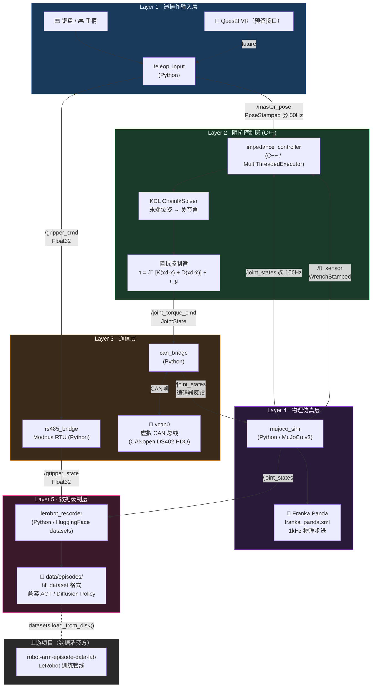

# Design Specification: `ros2-arm-teleoperation-suite`

**版本**：v0.1-draft  
**创建日期**：2026-06-23  
**作者**：Ina  
**目标岗位**：深兰人工智能科技 · 机器人控制工程师

---

## 1. 项目概述

### 1.1 目标

构建一套基于 ROS2 的机械臂遥操作全链路系统，在无实体机械臂硬件的条件下，通过软件仿真完整体现以下工程能力：

| 能力域 | 本项目体现方式 |
|---|---|
| 关节控制 / 力控制 | C++ 阻抗控制器节点 |
| CAN 总线通信 | Linux vcan 虚拟 CAN + python-can |
| RS485 通信 | pymodbus RTU 协议仿真节点 |
| 物理仿真 | MuJoCo v3 + Franka Panda 模型 |
| 遥操作架构 | 键盘/手柄 → Quest3 预留接口 |
| 具身智能数据 | LeRobot hf_dataset 格式录制 |
| ROS2 C++ | 阻抗控制器、IK 节点全 C++ 实现 |

### 1.2 与现有项目的关系

```
现有项目群                            本项目
─────────────────────────────────────────────────────
stm32-uart-pwm         ──叙事递进──▶  底层通信 → 上层控制
ros2-robot-digital-twin──架构同构──▶  主从闭环的机械臂升级版
ros2-moveit-pybullet   ──技术延伸──▶  PyBullet → MuJoCo 升级
robot-arm-episode-lab  ◀─数据上游──   LeRobot 数据送入训练管线
robot-ops-dashboard    ◀─可选扩展──   MQTT 关节力矩状态推送
```

**代码层**：完全独立仓库，不 import 任何现有项目。  
**数据层**：本项目生成的 LeRobot 格式数据集，可直接送入 `robot-arm-episode-data-lab` 训练管线。

---

## 2. 系统架构

### 2.1 整体数据流

```
┌──────────────────────────────────────────────────────────────────┐
│                   ros2-arm-teleoperation-suite                   │
│                                                                  │
│  ┌─────────────────────────────────┐                            │
│  │       Layer 1: 遥操作输入层       │                            │
│  │  teleop_input (Python Node)     │                            │
│  │  · 键盘 / 游戏手柄 → 末端位姿      │                            │
│  │  · topic: /master_pose          │                            │
│  │    (geometry_msgs/PoseStamped)  │                            │
│  │  · ⚡ Quest3 接入点预留在此 topic  │                            │
│  └────────────────┬────────────────┘                            │
│                   │ /master_pose                                 │
│                   ▼                                              │
│  ┌─────────────────────────────────┐                            │
│  │       Layer 2: 控制层（C++）      │                            │
│  │  impedance_controller (C++ Node)│                            │
│  │  · 订阅 /master_pose             │                            │
│  │  · 订阅 /ft_sensor（力矩反馈）     │                            │
│  │  · IK 解算：末端位姿 → 关节角      │                            │
│  │  · 阻抗控制律：                   │                            │
│  │    τ = K(xd-x) + D(ẋd-ẋ) + τ_g │                            │
│  │  · 发布 /joint_torque_cmd        │                            │
│  └────────────────┬────────────────┘                            │
│                   │ /joint_torque_cmd                            │
│                   ▼                                              │
│  ┌─────────────────────────────────┐                            │
│  │       Layer 3: CAN 通信层        │                            │
│  │  can_bridge (Python Node)       │                            │
│  │  · 接收 /joint_torque_cmd        │                            │
│  │  · 打包为 CANopen PDO 帧         │                            │
│  │  · 发送至 vcan0（虚拟 CAN 总线）   │                            │
│  │  · 读取 vcan0 编码器反馈帧        │                            │
│  │  · 发布 /joint_states            │                            │
│  │                                 │                            │
│  │  rs485_bridge (Python Node)     │                            │
│  │  · Modbus RTU 协议仿真           │                            │
│  │  · 发布 /gripper_state           │                            │
│  └────────────────┬────────────────┘                            │
│                   │ /joint_states / /gripper_state               │
│                   ▼                                              │
│  ┌─────────────────────────────────┐                            │
│  │       Layer 4: 物理仿真层        │                            │
│  │  mujoco_sim (Python Node)       │                            │
│  │  · 加载 franka_panda.xml         │                            │
│  │  · 执行关节力矩指令               │                            │
│  │  · 输出 contact force → /ft_sensor│                           │
│  │  · 发布真实仿真 /joint_states     │                            │
│  └────────────────┬────────────────┘                            │
│                   │ /joint_states + /ft_sensor                   │
│                   ▼                                              │
│  ┌─────────────────────────────────┐                            │
│  │       Layer 5: 数据录制层        │                            │
│  │  lerobot_recorder (Python Node) │                            │
│  │  · 订阅所有 observation topic    │                            │
│  │  · 录制 episode → LeRobot 格式   │                            │
│  │    (hf_dataset: obs + action)   │                            │
│  └─────────────────────────────────┘                            │
└──────────────────────────────────────────────────────────────────┘
```

### 2.1.1 架构图（Mermaid）



### 2.2 ROS2 话题列表

| Topic | 消息类型 | 发布者 | 订阅者 | QoS |
|---|---|---|---|---|
| `/master_pose` | `geometry_msgs/PoseStamped` | teleop_input | impedance_controller | Best Effort |
| `/joint_torque_cmd` | `sensor_msgs/JointState` | impedance_controller | can_bridge | Best Effort |
| `/joint_states` | `sensor_msgs/JointState` | mujoco_sim | impedance_controller, lerobot_recorder | Best Effort |
| `/ft_sensor` | `geometry_msgs/WrenchStamped` | mujoco_sim | impedance_controller | Best Effort |
| `/gripper_cmd` | `std_msgs/Float32` | teleop_input | rs485_bridge | Reliable |
| `/gripper_state` | `std_msgs/Float32` | rs485_bridge | lerobot_recorder | Best Effort |
| `/episode/status` | `std_msgs/String` | lerobot_recorder | — | Reliable |

---

## 3. 各模块详细设计

### 3.1 Layer 1: `teleop_input` — 遥操作输入节点

**语言**：Python  
**文件**：`src/teleop_input/teleop_input_node.py`

**功能**：
- 读取键盘输入（pynput）或游戏手柄（inputs 库），转换为末端执行器的 6DOF 位姿增量
- 维护当前末端位姿状态，以 50Hz 发布 `/master_pose`
- **Quest3 接入点**：外部 VR 节点只需向 `/master_pose` 发布数据，即可替换本节点

**键盘映射**（初始版本）：

| 按键 | 效果 |
|---|---|
| W/S | +/- X 方向平移 |
| A/D | +/- Y 方向平移 |
| Q/E | +/- Z 方向平移 |
| ↑↓ | Pitch 旋转 |
| ←→ | Yaw 旋转 |
| G | 夹爪开/关 |
| R | 开始/停止录制 Episode |
| Space | 急停（发布零速度） |

---

### 3.2 Layer 2: `impedance_controller` — 阻抗控制节点（C++ 核心）

**语言**：C++17  
**文件**：`src/impedance_controller/impedance_controller_node.cpp`  
**依赖**：`rclcpp`, `Eigen3`, `KDL`（运动学）

#### 3.2.1 阻抗控制律

在笛卡尔空间定义虚拟弹簧-阻尼系统：

```
F_cmd = K * (x_d - x) + D * (ẋ_d - ẋ)
τ_cmd = J^T * F_cmd + τ_gravity
```

其中：
- `K` ∈ ℝ^(6×6)：刚度矩阵（对角），默认值 `diag(500, 500, 500, 50, 50, 50)` [N/m, N·m/rad]
- `D` ∈ ℝ^(6×6)：阻尼矩阵（对角），默认值 `diag(50, 50, 50, 5, 5, 5)`
- `J`：末端雅可比矩阵（由 KDL 实时计算）
- `τ_gravity`：重力补偿项（由 KDL 计算）

#### 3.2.2 IK 解算

使用 KDL（Kinematics and Dynamics Library）的 `ChainIkSolverVel_pinv` 进行速度级逆运动学：
- 加载 URDF（`config/franka_panda.urdf`）构建 KDL Chain
- 以当前关节角为初始值，迭代求解目标末端位姿的关节角增量

#### 3.2.3 力控模式切换

通过 `/ft_sensor` 监测接触力，当合力 > `contact_threshold`（默认 5N）时：
- 自动切换到"柔顺模式"：降低刚度 K 的 Z 轴分量
- 体现典型的**接触力自适应阻抗调节**

#### 3.2.4 节点设计

```cpp
// 关键设计：使用 MultiThreadedExecutor + 两个 CallbackGroup
// cb_group_control_: MutuallyExclusive，用于控制指令串行处理
// cb_group_sensor_:  Reentrant，用于力矩和关节状态并发读取
rclcpp::CallbackGroup::SharedPtr cb_group_control_;
rclcpp::CallbackGroup::SharedPtr cb_group_sensor_;
```

---

### 3.3 Layer 3a: `can_bridge` — CAN 总线桥接节点

**语言**：Python  
**文件**：`src/can_bridge/can_bridge_node.py`  
**依赖**：`python-can`, `cantools`（DBC 文件解析）

#### 3.3.1 虚拟 CAN 环境配置

```bash
# scripts/setup_vcan.sh
sudo modprobe vcan
sudo ip link add dev vcan0 type vcan
sudo ip link set up vcan0
echo "[OK] vcan0 interface ready"
```

**切换实体硬件**：只需修改 `config/can_config.yaml` 中 `interface: vcan0` → `interface: can0`，代码不变。

#### 3.3.2 CANopen PDO 帧格式

模拟标准 CANopen DS402（电机驱动器规范）：

| 方向 | CAN ID | 数据含义 | 长度 |
|---|---|---|---|
| PC → 驱动器 | `0x200 + node_id` | TPDO1: 目标力矩（int16, 0.001 N·m/bit） | 8 bytes |
| 驱动器 → PC | `0x180 + node_id` | RPDO1: 实际位置（int32, encoder counts）| 8 bytes |

#### 3.3.3 节点逻辑

```python
# 发送方向（控制指令 → CAN 帧）
def joint_cmd_callback(self, msg: JointState):
    for i, (name, torque) in enumerate(zip(msg.name, msg.effort)):
        frame = can.Message(
            arbitration_id=0x200 + i,
            data=pack_torque_pdo(torque),
            is_extended_id=False
        )
        self.bus.send(frame)

# 接收方向（CAN 帧 → joint_states）
def can_receive_loop(self):
    for msg in self.bus:
        if is_encoder_feedback(msg):
            joint_pos = decode_encoder_pdo(msg)
            self.publish_joint_states(joint_pos)
```

---

### 3.4 Layer 3b: `rs485_bridge` — RS485 Modbus 仿真节点

**语言**：Python  
**文件**：`src/can_bridge/rs485_modbus_node.py`  
**依赖**：`pymodbus`

**设计**：模拟一个夹爪控制器的 Modbus RTU 通信：
- 使用 `pymodbus` 的 `ModbusTcpServer`（软件仿真，无串口硬件）
- 写寄存器 `0x0040`：控制夹爪开合度（0-1000 映射 0-100%）
- 读寄存器 `0x0041`：读取夹爪实际位置反馈
- ROS2 节点封装 Modbus 客户端，对外暴露 `/gripper_cmd` 和 `/gripper_state` 话题

---

### 3.5 Layer 4: `mujoco_sim` — MuJoCo 物理仿真节点

**语言**：Python  
**文件**：`src/mujoco_sim/mujoco_sim_node.py`  
**依赖**：`mujoco >= 3.0`, `mujoco-viewer`

**机器人模型**：Franka Panda（`config/models/franka_panda.xml`）

**核心循环（1kHz 物理步进，100Hz ROS2 发布）**：
```python
while rclpy.ok():
    # 物理步进（1kHz）
    mujoco.mj_step(self.model, self.data)
    
    # 以 100Hz 频率向 ROS2 发布
    if self.should_publish():
        self.pub_joint_states.publish(self.get_joint_states())
        self.pub_ft_sensor.publish(self.get_contact_force())
```

**接触力获取**：
```python
def get_contact_force(self) -> WrenchStamped:
    # 读取 MuJoCo contact 数组中末端传感器的力矩数据
    force = self.data.sensor('ee_force_sensor').data.copy()
    torque = self.data.sensor('ee_torque_sensor').data.copy()
    return build_wrench_msg(force, torque)
```

---

### 3.6 Layer 5: `lerobot_recorder` — LeRobot 格式数据录制节点

**语言**：Python  
**文件**：`src/lerobot_recorder/recorder_node.py`  
**依赖**：`datasets` (HuggingFace), `PIL`, `numpy`

**LeRobot 标准数据结构**（每个时间步）：

```python
episode_step = {
    "observation.state":    joint_positions,       # shape: (7,) float32
    "observation.images.top": camera_frame,         # shape: (H, W, 3) uint8
    "action":               target_joint_positions, # shape: (7,) float32
    "timestamp":            t,                      # float64
    "episode_index":        episode_id,             # int64
    "frame_index":          frame_idx,              # int64
    "done":                 is_done,                # bool
}
```

**录制流程**：
1. 用户按 `R` 键 → 节点开始缓存当前 episode 数据
2. 用户再按 `R` 或任务完成 → 节点将 buffer 写入 `hf_dataset` 格式
3. 数据保存至 `data/episodes/` 目录，可直接用 `datasets.load_from_disk()` 加载

---

## 4. 目录结构

```
ros2-arm-teleoperation-suite/
├── docs/
│   └── DESIGN_SPEC.md          ← 本文件（含 §2.1.1 Mermaid 架构图）
│
├── src/
│   ├── impedance_controller/   ← C++ 控制节点（ROS2 package）
│   │   ├── CMakeLists.txt
│   │   ├── package.xml
│   │   ├── include/
│   │   │   └── impedance_controller/
│   │   │       └── impedance_controller_node.hpp
│   │   └── src/
│   │       └── impedance_controller_node.cpp
│   │
│   ├── can_bridge/             ← CAN + RS485 通信节点（Python package）
│   │   ├── package.xml
│   │   ├── setup.py
│   │   ├── can_bridge/
│   │   │   ├── can_bridge_node.py
│   │   │   └── rs485_modbus_node.py
│   │   └── resource/
│   │
│   ├── mujoco_sim/             ← MuJoCo 仿真节点（Python package）
│   │   ├── package.xml
│   │   ├── setup.py
│   │   └── mujoco_sim/
│   │       └── mujoco_sim_node.py
│   │
│   ├── teleop_input/           ← 遥操作输入节点（Python package）
│   │   ├── package.xml
│   │   ├── setup.py
│   │   └── teleop_input/
│   │       └── teleop_input_node.py
│   │
│   └── lerobot_recorder/       ← LeRobot 数据录制节点（Python package）
│       ├── package.xml
│       ├── setup.py
│       └── lerobot_recorder/
│           └── recorder_node.py
│
├── config/
│   ├── can_config.yaml         ← CAN 接口配置（vcan0 / can0）
│   ├── controller_params.yaml  ← K/D 矩阵、阻抗控制参数
│   ├── recorder_config.yaml    ← LeRobot 录制配置
│   └── models/
│       └── franka_panda.xml    ← MuJoCo 机器人模型
│
├── scripts/
│   ├── setup_vcan.sh           ← 一键配置虚拟 CAN 总线
│   ├── install_deps.sh         ← 依赖安装脚本
│   └── launch_all.py           ← 一键启动全链路
│
├── tests/
│   ├── test_impedance_controller.cpp   ← C++ GTest 单元测试
│   ├── test_can_bridge.py              ← CAN 帧编解码测试
│   └── test_lerobot_format.py          ← 录制数据格式验证
│
├── data/
│   └── episodes/               ← 录制的 LeRobot 数据集（gitignore）
│
├── media/                      ← 演示视频、GIF（简历/README 用）
│
├── launch/
│   └── full_system.launch.py   ← ROS2 launch 文件
│
├── .gitignore
├── README.md                   ← 中英双语（待补充）
└── requirements.txt            ← Python 依赖列表
```

---

## 5. 开发里程碑

| 里程碑 | 目标 | 验收标准 | 预计用时 |
|---|---|---|---|
| **M0** | LeRobot 预适配（现有项目） | `export_to_lerobot.py` 可成功转换 HDF5 → hf_dataset | 1-2 天 |
| **M1** | 环境搭建 + CAN 层 | `vcan0` 收发 CAN 帧，RS485 Modbus 仿真运行 | Week 1 |
| **M2** | MuJoCo × ROS2 桥接 | Franka Panda 在 MuJoCo 中响应 joint_torque_cmd | Week 2 |
| **M3** | 阻抗控制器（C++） | 末端跟踪误差 < 2mm，接触柔顺响应可见 | Week 3-4 |
| **M4** | 全链路贯通 | 键盘输入 → 控制 → CAN → MuJoCo → 反馈，闭环稳定 | Week 5 |
| **M5** | LeRobot 录制 | 录制一段 50 步 Episode，可被 `datasets.load_from_disk()` 读取 | Week 5 |
| **M6** | 收尾发布 | README 中英双语，演示视频，简历 Bullet Points 更新 | Week 6 |

---

## 6. 依赖清单

### Python 依赖（`requirements.txt`）

```
mujoco>=3.0.0
python-can>=4.0.0
cantools>=36.0.0
pymodbus>=3.0.0
pynput>=1.7.6
inputs>=0.5
datasets>=2.14.0
Pillow>=10.0.0
numpy>=1.24.0
rclpy  # ROS2 内置
```

### C++ 依赖（`CMakeLists.txt`）

```cmake
find_package(rclcpp REQUIRED)
find_package(Eigen3 REQUIRED)
find_package(orocos_kdl REQUIRED)
find_package(sensor_msgs REQUIRED)
find_package(geometry_msgs REQUIRED)
```

### 系统依赖

```bash
# Linux 内核模块（CAN）
sudo apt install can-utils linux-modules-extra-$(uname -r)

# ROS2 相关
sudo apt install ros-jazzy-kdl-parser ros-jazzy-robot-state-publisher

# MuJoCo 模型
# 从 https://github.com/google-deepmind/mujoco_menagerie 获取 franka_panda.xml
```

---

## 7. 简历 Bullet Points 草稿（完成后更新）

> **以下为项目完成后的简历描述模板，开发过程中持续补充量化数据**

- **【系统集成】** 独立设计并实现五层机械臂遥操作全链路系统（遥操作输入 → 笛卡尔阻抗控制 → CAN 总线 → MuJoCo 物理仿真 → LeRobot 数据录制），系统端到端控制延迟 < __ ms。

- **【力控制】** 基于 C++ 实现笛卡尔空间六维阻抗控制器，设计 6×6 刚度矩阵（K）和阻尼矩阵（D），在 MuJoCo 仿真中实现 Franka Panda 末端位置跟踪误差 < 2mm，并实现接触力自适应刚度调节。

- **【CAN 通信】** 基于 Linux SocketCAN / vcan 虚拟总线，实现 CANopen DS402 协议的 PDO 帧编解码，完成 ROS2 控制器与电机驱动器之间的 CAN 总线通信层，支持一键切换 vcan0 / can0 物理接口。

- **【RS485 协议】** 使用 pymodbus 实现 Modbus RTU 夹爪控制器仿真节点，完成寄存器级读写控制，封装为 ROS2 标准话题接口。

- **【具身智能数据】** 实现 LeRobot 标准格式（hf_dataset）的示教 Episode 录制节点，数据结构与 HuggingFace Open-X-Embodiment 兼容，可直接送入 ACT / Diffusion Policy 训练管线。

---

## 8. 面试话术要点（针对深兰）

### Q：你有 CAN 总线开发经验吗？

> "是的。我在 `ros2-arm-teleoperation-suite` 项目中使用 Linux SocketCAN 框架实现了完整的 CAN 通信层。我基于 CANopen DS402 协议，实现了控制指令的 PDO 帧打包发送和编码器反馈的解码，通过 `vcan0` 虚拟接口进行全软件调试。这个方案的工程优势在于切换实体硬件时仅需修改接口名称，协议层代码完全不变——这是工业机器人调试的标准实践。"

### Q：你的力控制是怎么实现的？

> "在阻抗控制器中，我在笛卡尔空间建立了虚拟弹簧-阻尼模型。控制律为 `τ = J^T * [K(xd-x) + D(ẋd-ẋ)] + τ_gravity`，其中 K 和 D 是可配置的 6×6 对角矩阵，分别控制平移和旋转方向的刚度和阻尼。当 `/ft_sensor` 检测到接触力超过阈值时，系统自动降低接触方向的刚度，实现柔顺接触。整个控制器用 C++ 实现，配合 MultiThreadedExecutor 保证控制频率不被传感器回调阻塞。"
