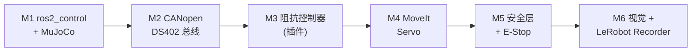

# 开发路线图：`ros2-arm-teleoperation-suite` (V2)

**版本**：v2.0  
**更新日期**：2026-06-24  
**目标**：构建工业级机械臂遥操作平台（七层栈），架构基线见 [`ARCHITECTURE_V2.md`](./ARCHITECTURE_V2.md)

> V1（五层教学版）路线图与 SPEC 已归档，见本文件末尾「V1 历史存档」。

---

## 总览

```
M1            M2             M3            M4           M5         M6
│             │              │             │            │          │
▼             ▼              ▼             ▼            ▼          ▼
ros2_control  CANopen DS402  阻抗控制器     MoveIt       安全层     视觉+
+ MuJoCo      现场总线        (插件)         Servo        + E-Stop   Recorder
```

自底向上搭工业栈：先有实时控制框架与物理引擎，再插入现场总线与驱动器，然后是控制律、运动层、安全层，最后补齐感知与数据闭环。

---

## 里程碑总表

| 里程碑 | 分支 | 核心目标 | 关键验收标准 |
|---|---|---|---|
| **M1** | `feat/v2-control-skeleton` | 描述 + ros2_control + MuJoCo 物理服务器 | `ros2 control list_controllers` 显示 `joint_state_broadcaster` active；Panda 重力补偿站立；`/joint_states` @1kHz；`/sim/*` 背板贯通 |
| **M2** | `feat/v2-canopen-fieldbus` | CANopen DS402 总线 + 虚拟伺服 | `candump vcan0` 抓到周期 RPDO/TPDO；DS402 到 `Operation Enabled`；`forward_command_controller` 经 CAN 驱动 Panda；故障注入→EMCY + `Fault`；`test_ds402_state_machine`/`test_pdo_codec` 通过 |
| **M3** | `feat/v2-impedance-controller` | 阻抗控制器（ros2_control 插件） | 插件被 controller_manager 加载且 active；给定 `/joint_target` 末端误差 <2mm；接触 >5N 柔顺；`update()` 稳定 1kHz；与 `jtc` 可热切 |
| **M4** | `feat/v2-motion-layer` | MoveIt Servo 运动层 | 键盘→`/safe_master_pose`(直通)→servo→`/joint_target`→阻抗→CAN→MuJoCo 端到端平滑；奇异/限位自动减速；端到端延迟 <50ms |
| **M5** | `feat/v2-safety-layer` | 安全层 + E-Stop 闭环 | 5 监视器逐项单测；越限指令被拒并保持安全位姿；心跳超时 100ms→E-Stop→DS402 Quick Stop→力矩归零；`/safety/reset` 复位；rqt_robot_monitor 可视化 |
| **M6** | `feat/v2-perception-recorder` | 视觉 + 多模态 Recorder + 收尾 | `/camera/color`+`/camera/depth` @30Hz；Recorder 多模态对齐；`LeRobotDataset.load` 字段完整；README/架构图/演示视频更新 |

---

## 里程碑依赖



---

## 分支策略

```
main
├── feat/v2-control-skeleton      ← M1（teleop_interfaces/description/canopen_hw_interface/mujoco_sim/bringup）
├── feat/v2-canopen-fieldbus      ← M2（virtual_servo_driver + DS402/PDO/SDO）
├── feat/v2-impedance-controller  ← M3（teleop_controllers 插件）
├── feat/v2-motion-layer          ← M4（teleop_moveit_config + servo）
├── feat/v2-safety-layer          ← M5（safety_monitor 5 监视器 + E-Stop）
└── feat/v2-perception-recorder   ← M6（camera_bridge + lerobot_recorder）
```

**合并规则**：每个 feat 分支 PR → main，保持 main 始终可 `colcon build`。
commit 格式：`type(scope): message`，例如 `feat(canopen_hw_interface): cyclic RPDO write`。

---

## 包 ↔ 里程碑映射

| 包 | 语言 | 引入里程碑 |
|---|---|---|
| `teleop_interfaces` | msg/srv | M1 |
| `teleop_description` | xacro | M1 |
| `canopen_hw_interface` | C++ | M1（直连）→ M2（接 CAN） |
| `mujoco_sim` | Python | M1 |
| `teleop_bringup` | launch | M1 |
| `virtual_servo_driver` | Python | M2 |
| `gripper_driver` | Python | M2 |
| `teleop_controllers` | C++ | M3 |
| `teleop_moveit_config` | config | M4 |
| `teleop_input` | Python | M4 |
| `safety_monitor` | C++ | M5 |
| `camera_bridge` | Python | M6 |
| `lerobot_recorder` | Python | M6 |

---

## 开发检查清单（逐里程碑）

### M1 — ros2_control 骨架 + MuJoCo
- [x] `teleop_interfaces` 构建通过，`SafetyStatus`/`DriveStatus`/`TriggerEstop` 可被发现
- [x] `teleop_description` 生成 URDF（`xacro` 展开无报错），含 `ros2_control` 标签
- [x] `mujoco_sim_node` 加载 Panda，开放 `/sim/joint_effort_cmd` 订阅 + `/sim/encoder_state` 发布
- [x] `canopen_hw_interface` 以「直连 sim」模式跑通（先不走 CAN），`controller_manager` 加载成功
- [x] `joint_state_broadcaster` active，`/joint_states` 输出 7 关节 measured state
- [x] `ros2 launch teleop_bringup m1_control_sim.launch.py` 一键起 M1 最小闭环（MoveIt/Safety/Recorder 不参与）

### M2 — CANopen DS402 现场总线
- [ ] `setup_vcan.sh` 建 vcan0；`virtual_servo_driver` ×7 上线
- [ ] DS402 状态机走通 `Switch On Disabled → Operation Enabled`
- [ ] `canopen_hw_interface` write→RPDO、read←TPDO，`candump vcan0` 可见周期帧
- [ ] `forward_command_controller` 经 CAN 驱动 Panda 运动
- [ ] 故障注入（过流/超速/通信）→ EMCY 帧 + 进入 `Fault`
- [ ] `test_ds402_state_machine.py` / `test_pdo_codec.py` 通过

### M3 — 阻抗控制器（插件）
- [ ] `cartesian_impedance_controller` 经 pluginlib 导出，`controller_manager` 加载 active
- [ ] command interface=`effort`，state interface=`position/velocity`
- [ ] 给定 `/joint_target`，末端跟踪误差 <2mm
- [ ] 接触力 >5N 自动降刚度（柔顺）
- [ ] `update()` 稳定 1kHz，可与 `joint_trajectory_controller` 热切

### M4 — MoveIt Servo 运动层
- [ ] `teleop_moveit_config` 的 `servo.yaml`/`kinematics.yaml` 就位
- [ ] `servo_node` 订阅 `/safe_master_pose`（pose 模式）→ 输出 `/joint_target`
- [ ] `teleop_input` 键盘映射 → `/teleop/cmd_pose`（M5 前先直通到 servo）
- [ ] 接近奇异/限位时 servo 自动减速
- [ ] 端到端延迟 <50ms

### M5 — 安全层 + E-Stop
- [ ] `safety_monitor` 5 个子监视器逐项 GTest 通过
- [ ] 越限指令被拒，保持上一安全位姿
- [ ] 心跳超时 100ms → `/safety/estop` → DS402 Quick Stop → 力矩归零
- [ ] `/safety/trigger_estop` / `/safety/reset` 服务可用
- [ ] `/safety/diagnostics` 在 rqt_robot_monitor 显示

### M6 — 视觉 + Recorder + 收尾
- [ ] `camera_bridge` 发布 `/camera/color`+`/camera/depth`+`camera_info` @30Hz
- [ ] `lerobot_recorder` 多模态 `ApproximateTimeSynchronizer` 对齐
- [ ] 录制 Episode → `LeRobotDataset.load` 字段完整（state/ee/ft/gripper/rgb/depth/action/ts）
- [ ] ACT 配置可直接消费数据集
- [ ] README/架构图/演示视频更新

---

## 关键风险与应对

| 风险 | 影响 | 应对 |
|---|---|---|
| `ros2_control` 自定义 HW 接口实时性不足 | M1/M3 抖动 | 先用 `mock_components` 直连验证逻辑，再切 CANopen |
| CANopen 周期 + SYNC 时序复杂 | M2 阻塞 | 先实现单关节 PDO 回环，再扩到 7 轴 |
| MoveIt Servo 配置门槛高 | M4 阻塞 | 先用官方 panda_moveit_config 模板裁剪 |
| MuJoCo 无 GPU 渲染相机慢 | M6 卡顿 | `headless:=true` + offscreen renderer |
| KDL/Jacobian 在插件里求解慢 | M3 控制频率不足 | 预计算 + Eigen，必要时降到位置阻抗 |

---

## V2 细化 SPEC 索引

各里程碑对应的细化 SPEC（`SPEC_V2_M*.md`）：

| 里程碑 | SPEC 文件 |
|---|---|
| M1 ros2_control + MuJoCo | [`SPEC_V2_M1_CONTROL_SKELETON.md`](./SPEC_V2_M1_CONTROL_SKELETON.md) |
| M2 CANopen DS402 现场总线 | [`SPEC_V2_M2_CANOPEN_FIELDBUS.md`](./SPEC_V2_M2_CANOPEN_FIELDBUS.md) |
| M3 阻抗控制器（插件） | [`SPEC_V2_M3_IMPEDANCE_CTRL.md`](./SPEC_V2_M3_IMPEDANCE_CTRL.md) |
| M4 MoveIt Servo 运动层 | [`SPEC_V2_M4_MOTION_LAYER.md`](./SPEC_V2_M4_MOTION_LAYER.md) |
| M5 安全层 + E-Stop | [`SPEC_V2_M5_SAFETY_LAYER.md`](./SPEC_V2_M5_SAFETY_LAYER.md) |
| M6 视觉 + LeRobot Recorder | [`SPEC_V2_M6_PERCEPTION_RECORDER.md`](./SPEC_V2_M6_PERCEPTION_RECORDER.md) |

---

## V1 历史存档

V1 为五层教学版（teleop → impedance(独立节点) → can_bridge → mujoco → recorder），相关文档：
- [`DESIGN_SPEC.md`](./DESIGN_SPEC.md)（V1 总体设计）
- [`SPEC_M1_CAN_RS485.md`](./SPEC_M1_CAN_RS485.md) / [`SPEC_M2_MUJOCO_BRIDGE.md`](./SPEC_M2_MUJOCO_BRIDGE.md) / [`SPEC_M3_IMPEDANCE_CTRL.md`](./SPEC_M3_IMPEDANCE_CTRL.md) / [`SPEC_M4_FULL_PIPELINE.md`](./SPEC_M4_FULL_PIPELINE.md) / [`SPEC_M5_LEROBOT_RECORDER.md`](./SPEC_M5_LEROBOT_RECORDER.md)

> 这些文档保留作演进对照，**当前开发以 V2 为准，见上方 V2 细化 SPEC 索引**。
